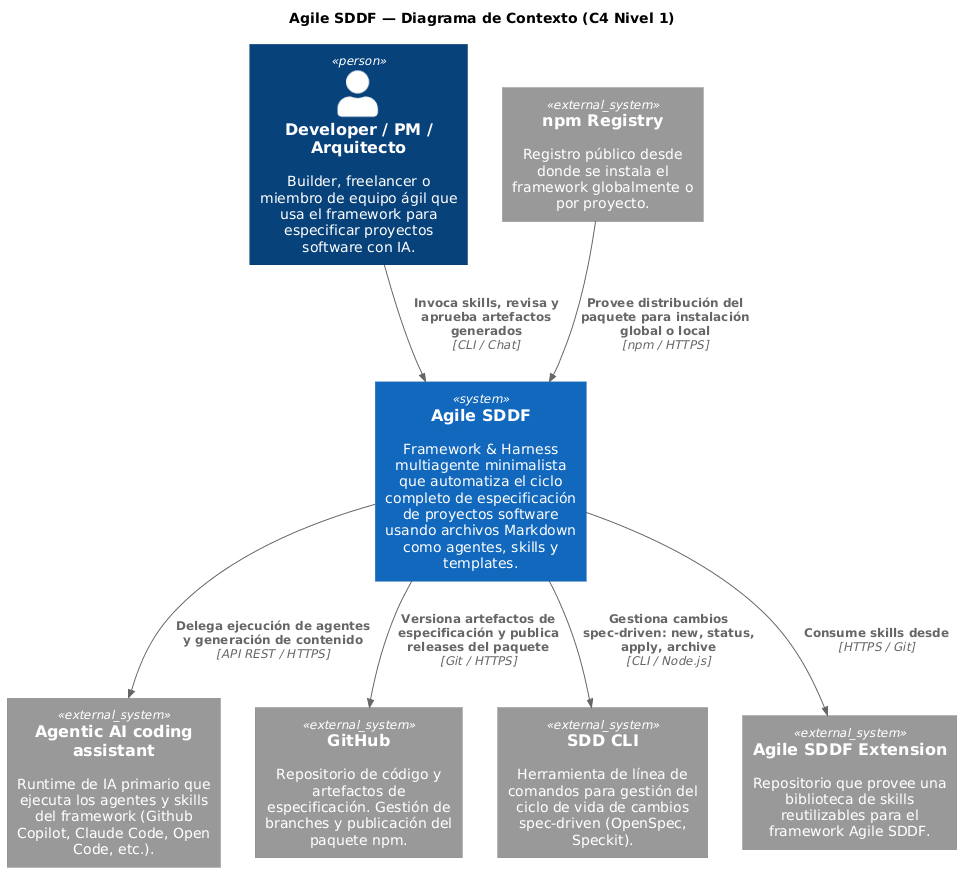
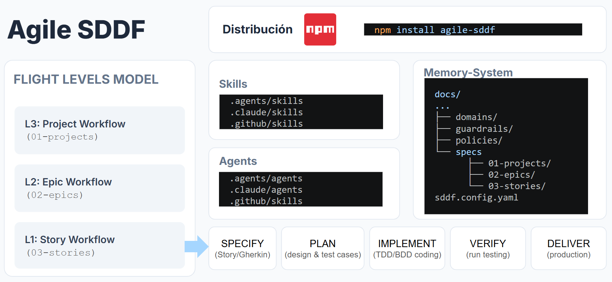

# Agile SDDF — Spec-Driven Development Framework

Sistema multiagente minimalista que automatiza el ciclo completo de especificación de proyectos software usando solo archivos Markdown como agentes, skills y templates.

[](https://npmjs.com/package/agile-sddf)
[](LICENSE)

> ### ⚠️ ¿Vienes de la versión 1.x? Lee esto antes de actualizar
>
> La **2.0.0 cambia la estructura de directorios de `docs/specs/` y el nombre de varios artefactos**,
> sin alias retrocompatibles. Si actualizas sin migrar, los skills no encontrarán tus documentos
> existentes y los comandos `/release-*` dejarán de existir.
>
> | Antes (1.x) | Ahora (2.0.0) |
> |---|---|
> | `docs/specs/projects/` | `docs/specs/01-projects/` |
> | `docs/specs/releases/` | `docs/specs/02-epics/` |
> | `docs/specs/stories/` | `docs/specs/03-stories/` |
> | `release.md` (`type: release`) | `epic.md` (`type: epic`) |
> | `FEAT-NNN-<slug>/` | `STORY-NNN-<slug>/` |
> | `/release-creation`, `/release-generate-stories`, … | `/epic-creation`, `/epic-generate-stories`, … |
>
> 👉 **[Cómo migrar tu proyecto](#upgrading-desde-1x)** — pasos y comandos.

Los developers y equipos que trabajan con IA para desarrollar software carecen de un proceso estructurado y reproducible para transformar ideas en especificaciones de calidad. Agile SDDF resuelve esto con un workflow ágil y secuencial que cubre desde la intención inicial hasta el backlog planificado de historias de usuario, con control de WIP, gates de revisión humana y trazabilidad completa en cada etapa. A diferencia de los prompts ad-hoc o frameworks rígidos, el sistema extrae dinámicamente la estructura de los templates en runtime para generar preguntas y comportamientos contextuales, y opera en etapa de especificación sin modificar código subyacente en los runtimes soportados (Claude Code, OpenCode y GitHub Copilot). En etapa de implementación, SDDF genera código de producción + tests con TDD, y reportes de implementación y revisión de código para garantizar calidad y coherencia con la especificación.

### Context Diagram


### Blueprint


## Table of Contents

- [Features](#features)
- [Installation](#installation)
- [Upgrading desde 1.x](#upgrading-desde-1x) ⚠️
- [Initialization](#initialization)
- [Quick Start](#quick-start)
- [Usage](#usage)
- [Configuration](#configuration)
- [Profiles and extensions](#profiles-and-extensions)
- [Contributing](#contributing)
- [License](#license)

## Features


- Los skills de SDDF son sometidos a auditorìa de seguridad mediante Skill Shielder. 
- **Ingeniería inversa de repositorios**: genera `requirement-spec.md` automáticamente desde código existente mediante análisis paralelo de 4 agentes especializados
- **Pipeline a nivel de proyecto**: workflow secuencial Begin Intention → Discovery → Planning con gates de revisión humana entre cada fase
- **Control WIP=1**: impide proyectos activos simultáneos, ofreciendo exactamente las opciones Sobrescribir o Retomar
- **User Story Mapping**: sesión colaborativa al estilo Jeff Patton para construir backbone, walking skeleton y slices de épicas
- **Gestión de épicas**: planificación de épicas con `project-plan.md` y generación automática de artefactos de épica (feature specs, historias de usuario) con trazabilidad completa
- **Gestión de historias de usuario**: creación (Como/Quiero/Para + Gherkin), evaluación con rúbrica FINVEST (Likert 1–5), splitting con 8 patrones y refinamiento iterativo
- **SDD workflow**: Se implemente un workflow a nivel de story "SPECIFY --> PLAN --> READY-FOR-IMPLEMENT --> IMPLEMENT --> CODE-REVIEW --> VERIFY --> ACCEPTANCE --> DELIVER --> COMPLETED" con skills dedicados para cada fase y generación de artefactos específicos (design.md, tasks.md, analyze.md, implement-report.md, code-review-report.md)
- **Pipeline SDD completo de historia**: planning y implementación tarea a tarea — `story-plan` orquesta `story-design` → `story-tasking` → `story-testcases` → `story-analyze` en un solo comando; `story-implement` ejecuta el ciclo TDD completo (RED→GREEN→REFACTOR) delegando a skills configurables por stack tecnológico (`sddf.config.yaml`): genera tests con el skill `test_generator` declarado, implementa código con el `code_generator` y refactoriza sin romper suites; soporta modo interactivo (con pausas de confirmación entre fases) y modo automático (`--auto`) para CI; `story-code-review` para revisión multi-agente post-implementación
- **Skills worker customizados (extensión)**: los workers específicos por stack —generadores de tests y de código para NestJS, React, Cypress/Playwright + Cucumber— **no se incluyen en este paquete**. Viven en [`agile-sddf-extension`](https://github.com/dariopalminio/agile-sddf-extension), se instalan por separado y se declaran en `sddf.config.yaml`, de modo que el core permanece agnóstico al stack mientras esos workers evolucionan en su propio repo. Ver [Profiles and extensions](#profiles-and-extensions).
- **Configuración operacional por stack (`sddf.config.yaml`)**: archivo versionado en la raíz del proyecto que declara `root` para los artefactos SDDF y los skills activos para cada fase del pipeline TDD; `SDDF_ROOT` es un override temporal válido solo si apunta a un directorio accesible. `sddf-init` genera la configuración desde un template canónico.
- **Políticas de proyecto**: generación de `constitution.md` y `dod-story.md` con `project-policies-generation`, registrando referencias automáticamente en `CLAUDE.md` / `AGENTS.md`
- **Extensiones opt-in**: OpenSpec, los meta-skills y los workers específicos de stack no forman parte del core; se declaran y provisionan explícitamente como extensiones.
- **Multi-runtime**: los mismos skills operan en Claude Code, OpenCode y GitHub Copilot sin modificar la fuente. El instalador usa sus rutas canónicas, declaradas en `config/runtimes.json`.
- **Trazabilidad completa**: IDs únicos STORY-NNN y manejo de sub-estados IN-PROGRESS/Ready en cada documento del pipeline
- **Docs as Wiki**: skill docs-wiki-builder para generar documentación de proyecto en formato wiki navegable. Incluye un skill header-aggregation para generar encabezados frontmatter de archivo '.md'. Permite navegación bidireccional entre documentos, generación de índices automáticos y visualización de grafos con "Foam for VSCode".

## Profiles and extensions

El manifiesto [`config/profiles.json`](config/profiles.json) separa lo que el paquete distribuye de las herramientas con las que se desarrolla este repositorio. `core` es el perfil predeterminado; `dogfood` es deliberadamente más estricto y requiere extensiones provisionadas de manera explícita y fijada.

| Capacidad | Perfil | Origen | Runtime compatible | Requisito externo |
|---|---|---|---|---|
| Pipeline de proyectos, épicas e historias | `core` | Paquete npm | Claude Code, OpenCode, GitHub Copilot | Node.js 18+ |
| Inicialización y políticas SDDF | `core` | Paquete npm | Los tres runtimes soportados | Ninguno |
| Instalación de skills y agentes | `core` | Paquete npm + `config/runtimes.json` | Los tres runtimes soportados | Acto explícito `agile-sddf install` |
| Workers TDD específicos de stack | Extensión | `agile-sddf-extension` | Según el worker | Instalación y configuración explícitas |
| `skill-master` y `skill-test-evals` | `dogfood` | Extensión fijada en `config/profiles.json` | Los tres runtimes soportados | Lock local y workers provisionados |
| OpenSpec | Extensión | No se distribuye en core | Según la extensión | Instalación explícita de la extensión |
| `security-audit` | Control del repositorio | CI y guardrails de este repositorio | No aplica como capacidad core | Ejecución de CI/mantenedor |

Un **stack** es la composición declarada de comandos de verificación y workers de un perfil; no es una tercera instalación implícita. La decisión y las rutas canónicas están registradas en [ADR-0009](docs/adr/ADR-0009-perfiles-runtimes-e-instalacion-explicita.md).

## Installation

`npm install` descarga el paquete, pero **no escribe directorios de runtime**. La copia de skills y agentes siempre requiere un acto explícito; por eso `npm install --ignore-scripts` es una práctica defensiva válida, no un workaround.

```bash
npm install agile-sddf
npx agile-sddf install
```

O específicamente para un runtime determinado:
```bash
npm install agile-sddf
npx agile-sddf install --target claude-code
```

### Monorepos con pnpm (workspaces)

Desde la raíz del workspace, agrega el paquete al workspace raíz y ejecuta la
instalación del runtime de forma explícita:

```bash
pnpm add -w agile-sddf
pnpm exec agile-sddf install
```
O específicamente para un runtime determinado:
```bash
pnpm add -w agile-sddf
pnpm exec agile-sddf install --target claude-code
```

No es necesario configurar `allowedBuiltDependencies`: la instalación no usa
`postinstall` ni crea directorios de runtime hasta ejecutar el segundo comando.

Para una instalación global, usa el mismo runtime de forma explícita:

```bash
npm install -g agile-sddf
agile-sddf install --global --target claude-code
```

<!-- runtime-contract:start -->
| Runtime | `--target` | Destino local | Destino global |
|---|---|---|---|
| Claude Code | `claude-code` | `.claude/` | `~/.claude/` |
| OpenCode | `opencode` | `.opencode/` | `~/.config/opencode/` |
| GitHub Copilot | `github-copilot` | `.github/` | `~/.copilot/` |
<!-- runtime-contract:end -->

Usa esos IDs canónicos en nuevas instalaciones. Para migrar, el CLI aún acepta los aliases de carpeta `.claude`, `.opencode` y `.github`; no son una fuente de destinos adicional. `.agents/skills` es una ruta de compatibilidad de skills para algunos runtimes, pero no instala agentes de forma canónica y no es un target válido.

### Migrar desde 2.x

La versión 3.0.0 elimina la copia automática de `postinstall`. Después de actualizar, ejecuta una vez `npx agile-sddf install --target <runtime>`; por ejemplo `--target claude-code`.

### CLI reference

| Comando | Descripción |
|---------|-------------|
| `agile-sddf install` | Instala en el runtime predeterminado (`claude-code`) |
| `agile-sddf install --target opencode` | Copia al destino canónico de OpenCode |
| `agile-sddf install --global --target github-copilot` | Copia al destino global de Copilot |
| `agile-sddf install --force` | Sobrescribe archivos existentes para un upgrade |
| `agile-sddf help` | Muestra los IDs y rutas vigentes |

### Prerequisites

- Node.js >= 18
- Runtime compatible: Claude Code (Anthropic), GitHub Copilot, OpenCode.
- Foam for VSCode: opcional, recomendado para navegación de docs como wiki.
- PlantUML extension para VSCode: opcional, recomendado para visualizar diagramas c4 generados.

## Upgrading desde 1.x

> ⚠️ **Cambio incompatible.** La 2.0.0 renombra el work item de nivel medio (`release` → **épica**),
> cambia el prefijo de ID del nivel L1 (`FEAT-NNN` → **`STORY-NNN`**) y reestructura `docs/specs/` en
> directorios numerados por nivel de vuelo. **No hay alias retrocompatibles ni fallback automático.**

**Si empiezas un proyecto nuevo, ignora esta sección**: `/sddf-init` ya crea la estructura correcta.

### Por qué cambió

`release` colisionaba con su sentido de CI/CD (liberación, despliegue, versión publicada), hasta el
punto de que la documentación tenía que aclarar que «el release a nivel de gestión de trabajo es
independiente del release real». Desde la 2.0.0, **`release` queda reservado exclusivamente para
CI/CD** y el work item intermedio es siempre una **épica**. En paralelo, `FEAT` nombraba un *tipo* de
trabajo, no un nivel, y chocaba con el prefijo de rama (`fix/FEAT-042` se contradice); ahora el tipo
vive en el campo `kind` del frontmatter. El razonamiento completo está en los ADR
[0004](https://github.com/dariopalminio/agile-sddf/blob/main/docs/adr/ADR-0004-nivel-l2-epic-y-directorios-numerados.md) y
[0005](https://github.com/dariopalminio/agile-sddf/blob/main/docs/adr/ADR-0005-prefijo-story-para-el-nivel-l1.md).

El número de cada historia **se conserva 1:1** (`FEAT-042` ≡ `STORY-042`), así que toda referencia
histórica sigue siendo trazable.

### Migración

Haz commit de tu trabajo antes de empezar y ejecuta los pasos desde la raíz del proyecto. Ajusta
`docs/` por el `SPECS_BASE` efectivo si tu `sddf.config.yaml` declara otro `root` o si aplicas un
override válido mediante `SDDF_ROOT`.

```bash
# 1. Artefacto release.md → epic.md, su frontmatter y la sección del plan
find docs/specs/releases -name release.md -execdir git mv release.md epic.md \;
sed -i 's/^type: release$/type: epic/' docs/specs/releases/*/epic.md
sed -i 's/^## Propuesta de Releases$/## Propuesta de Épicas/;s/^### Release \([0-9]\{2\}\) —/### Épica \1 —/' docs/specs/projects/*/project-plan.md

# 2. Directorios de nivel → numerados
git mv docs/specs/projects docs/specs/01-projects
git mv docs/specs/releases docs/specs/02-epics
git mv docs/specs/stories  docs/specs/03-stories

# 3. Referencias de ruta dentro de tus propios documentos
grep -rlZ 'specs/projects\|specs/releases\|specs/stories' docs \
  | xargs -0 sed -i -e 's|specs/projects|specs/01-projects|g' \
                    -e 's|specs/releases|specs/02-epics|g' \
                    -e 's|specs/stories|specs/03-stories|g'

# 4. Prefijo de historia FEAT- → STORY- (el número se conserva)
for d in docs/specs/03-stories/FEAT-*; do git mv "$d" "${d/FEAT-/STORY-}"; done
grep -rlZ 'FEAT-' docs | xargs -0 sed -i 's/FEAT-/STORY-/g'

# 5. Sección de las épicas y campo kind en las historias
sed -i 's/^## Features *$/## Historias/' docs/specs/02-epics/*/epic.md
sed -i '/^id: STORY-/a kind: feat' docs/specs/03-stories/*/story.md

# 6. Reinstalar los skills renombrados
npx agile-sddf install --force
```

### Después de migrar: revisa estos cuatro puntos

> **Nota histórica:** estas rutas describen la línea 2.x. En 3.0.0, la instalación explícita y las rutas canónicas se rigen por [Installation](#installation).

1. **Borra a mano los directorios `release-*` huérfanos** en `.claude/skills/` (o el directorio de skills del runtime instalado). El instalador copia los skills nuevos pero no elimina los antiguos, así que
   convivirían `/release-creation` y `/epic-creation`.
2. **Historias con prefijo propio** (`FIX-`, `BUG-`, `CHORE-`): el paso 4 **no las toca**. Renoméralas
   al siguiente `STORY-NNN` libre y asígnales su `kind`. Si no lo haces quedan invisibles al glob
   `03-stories/STORY-*/` que usan `story-creation`, `story-evaluation` y `epic-generate-stories` para
   calcular el siguiente ID — y el cálculo puede asignar un número en colisión.
3. **Revisa el `kind: feat` por defecto** del paso 5: las historias que en realidad sean correcciones
   o tareas técnicas quedan mal clasificadas hasta que las ajustes a `fix` / `chore` / `hotfix`.
4. **Borra el `release-spec-template.md` huérfano** de `{SPECS_BASE}/templates/` tras
   reejecutar `/sddf-init`; ahora se llama `epic-template.md`. Sin reejecutarlo, los skills caen en el
   fallback al template semilla con un `WARNING`, sin romperse.

### Comandos renombrados

| Antes | Ahora |
|---|---|
| `/release-creation` | `/epic-creation` |
| `/release-format-validation` | `/epic-format-validation` |
| `/releases-from-project-plan` | `/epic-from-project-plan` |
| `/release-generate-stories` | `/epic-generate-stories` |
| `/release-generate-all-stories` | `/epic-generate-all-stories` |

Los triggers en lenguaje natural antiguos («crear release», «validar release», …) **no** se conservan
como alias. El detalle completo de la versión está en el [CHANGELOG](CHANGELOG.md).

## Initialization

Después de instalar el paquete, inicializa la estructura de directorios SDDF en tu proyecto con:

```bash
/sddf-init
```

Este skill crea los directorios base de artefactos bajo `<SPECS_BASE>/specs/`, genera `sddf.config.yaml` con `root: docs` cuando no existe una configuración y deja `.env.template` como documentación del override opcional `SDDF_ROOT`. Solo es necesario ejecutarlo una vez por proyecto.

```
── sddf-init ────────────────────────────────────
[CREADO]     docs/specs/01-projects/
[CREADO]     docs/specs/02-epics/
[CREADO]     docs/specs/03-stories/
[CREADO]     sddf.config.yaml
[CREADO]     .env.template
─────────────────────────────────────────────────
✓ Entorno SDDF inicializado correctamente en docs/
```

Si una fuente de raíz explícita (`SDDF_ROOT` o `sddf.config.yaml.root`) no es utilizable, el skill lo reporta como error antes de crear cualquier archivo. Consulta la sección [Configuration](#configuration) para más detalles.

> **skill-preflight:** `/skill-preflight` es un diagnóstico explícito y de solo lectura. Informa la raíz efectiva, la fuente que la determinó, la estructura y los templates; los skills ordinarios resuelven ese contrato localmente y no lo invocan automáticamente.

## Quick Start

Inicia el pipeline completo de especificación en una sola sesión desde Claude Code:

```bash
# Ejecuta las tres fases del pipeline en una sesión continua
/project-flow
```

O ejecuta cada fase individualmente:

```bash
# Fase 1 — Captura la intención del proyecto
/project-begin

# Fase 2 — Discovery de usuarios y especificación de requisitos
/project-discovery

# Fase 3 — Planificación de épicas y backlog de historias
/project-planning
```

### Inicialización de políticas del proyecto

Antes de iniciar el pipeline, genera las políticas del proyecto para que todos los skills operen con las mismas reglas de calidad y convenciones técnicas:

```bash
# Genera constitution.md y dod-story.md con preguntas guiadas
/project-policies-generation
```

Los archivos se crean en `docs/policies/` y se referencian automáticamente en `CLAUDE.md` / `AGENTS.md`. Solo es necesario ejecutarlo una vez; actualízalos cuando cambien las convenciones del equipo.

## Usage

### Flujos principales SDDF

SDDF se organiza en tres niveles principales que cubren todo el ciclo de vida de la especificación, desde la intención inicial (nivel de proyecto o L3), la especificación de entregables o épicas (L2) y la especificación de historias (L1). OpenSpec es una integración opcional de extensión, no una capacidad core. Cada nivel se compone de skills que operan sobre documentos Markdown con control de sub-estado `IN-PROGRESS`/`DONE` para garantizar un flujo estructurado, reproducible y automatizable.

#### 1. L3: Pipeline de especificación de proyecto (iniciativa)

project-begin → project-discovery → project-planning → project-story-mapping

project-flow orquesta los 3 primeros pasos en una sola sesión con gates de revisión entre etapas. project-story-mapping se ejecuta de forma opcional como sesión de mapeo colaborativo post-planning.

#### 2. L2: Pipeline de generación de épicas e historias

epic-from-project-plan

#### 3. L1: Pipeline de generación y refinamiento de historias (SPECIFY)

epic-generate-stories →

story-creation → story-evaluation → story-split → story-specify →

story-plan ( story-design → story-tasking → story-analyze ) → story-implement

`story-plan` orquesta los tres sub-skills de planning en secuencia con fail-fast y visibilidad de progreso. `story-implement` ejecuta TDD tarea por tarea y genera `implement-report.md` al finalizar.

#### Integración opcional con OpenSpec

OpenSpec se instala y configura como extensión. Sus comandos no se incluyen ni se ejecutan en una instalación `core`.

### Estructura de artefactos

### Estructura de políticas explícitas

Las políticas del proyecto son documentos Markdown versionados en el repositorio que actúan como fuente de verdad para todos los agentes IA y miembros del equipo. Se generan con `/project-policies-generation` y se referencian automáticamente desde `CLAUDE.md` y `AGENTS.md` para que todos los skills las lean en cada sesión.

```
docs/policies/
├── constitution.md              # principios técnicos inamovibles
└── dod-story.md # criterios de terminado por estado
```

#### constitution.md

Define los principios que ningún skill ni agente puede violar. Contiene:

| Sección | Contenido |
|---------|-----------|
| Stack tecnológico | Lenguaje, runtime, frameworks y librerías core |
| Infraestructura | Control de versiones, contenedores, paquete npm |
| Convenciones de código | Estilo, formato y nomenclatura (kebab-case) |
| Estándares de skills | Estructura de directorios, frontmatter YAML, resolución local de raíz y patrón de delegación único |
| Patrones de nomenclatura | IDs jerárquicos (PROJ-NN, EPIC-NN, STORY-NNN), frontmatter canónico |
| Reglas de comportamiento | Control WIP=1, gates secuenciales, idempotencia, flags opcionales |
| Principios técnicos inamovibles | 10 principios — repositorio como sistema, orquestación multiagente, Spec-first, KISS, etc. |

Los skills leen `constitution.md` para mantener coherencia de patrones sin que el usuario tenga que repetir las reglas en cada sesión.

#### dod-story.md

Define los criterios de "terminado" para cada estado del ciclo de vida de una historia. Un skill de transición de estado verifica estos criterios antes de avanzar:

| Estado | Criterios clave |
|--------|-----------------|
| `SPECIFY` | Título claro, formato Como/Quiero/Para, Gherkin cubriendo escenarios principales, cumple INVEST, frontmatter completo |
| `PLAN` | `design.md` con trazabilidad a cada AC, `tasks.md` con tareas atómicas ordenadas, `analyze.md` sin ambigüedades técnicas abiertas |
| `IMPLEMENT` | Todos los escenarios Gherkin pasan, código sin TODOs ni imports sin usar, tests deterministas, cobertura no decrece |
| `CODE-REVIEW` | Sin hallazgos HIGH/MEDIUM, `tasks.md` sin tareas pendientes, `code-review-report.md` con `review-status: approved` |
| `ACCEPTANCE` | Escenarios validados manualmente, `acceptance-report.md` con resultado `ACCEPTANCE-APPROVED`, aprobación humana explícita |

#### Integración en el flujo

Los skills aplican estas políticas en dos momentos:

1. **Resolución local:** cada workflow determina `REPO_ROOT`, `SPECS_BASE` y la fuente de raíz antes de leer sus artefactos.
2. **Gate de transición:** skills como `story-code-review` y `story-acceptance` leen `dod-story.md` para decidir si el artefacto cumple los criterios del estado destino antes de actualizar `status`/`substatus` en el frontmatter.

```bash
# Genera o actualiza ambas políticas con preguntas guiadas
/project-policies-generation
```

### Estructura de artefactos de especificación

Los artefactos de especificación se organizan en directorios por workitem bajo
`{SPECS_BASE}/specs/`, donde `SPECS_BASE` se resuelve una vez por workflow:
`SDDF_ROOT` válida → `sddf.config.yaml.root` válida → `docs`.

```
docs/specs/
├── 01-projects/                          # L3 — proyecto
│   └── PROJ-01-nombre-proyecto/         # un directorio por proyecto
│       ├── project-intent.md
│       ├── project.md
│       ├── project-plan.md
│       └── story-map.md
├── 02-epics/                             # L2 — épica
│   └── EPIC-01-nombre-epica/            # un directorio por épica
│       └── epic.md
└── 03-stories/                           # L1 — historia
    └── STORY-001-nombre-historia/        # un directorio por historia
        ├── story.md                     # historia (story-creation)
        ├── finvest-evaluation-report.md # evaluación FINVEST (story-evaluation)
        ├── story-improvement-log.md     # log de mejoras aplicadas (story-improve)
        ├── design.md                    # diseño técnico (story-design)
        ├── tasks.md                     # plan de tareas (story-tasking)
        ├── analyze.md                   # reporte de coherencia (story-analyze)
        ├── testcases.md                 # tabla de casos de prueba tipificados UT/CT/IT/API/E2E/EV (story-testcases)
        ├── implement-report.md          # reporte de implementación (story-implement)
        ├── code-review-report.md        # reporte de revisión de código (story-code-review)
        ├── fix-directives.md            # instrucciones de corrección y ronda (round N) cuando hay bloqueantes; señal de rework (story-code-review)
        └── verify-report.md             # reporte de verificación (story-verify)
```

Cada archivo principal usa un nombre canónico (`project-intent.md`, `epic.md`, `story.md`) e incluye frontmatter con `type`, `id`, `slug`, `title`, `status`, `substatus`, `parent`, `created` y `updated`; las historias añaden `kind` (`feat` / `fix` / `chore` / `hotfix`), que determina el prefijo de su rama. Las relaciones jerárquicas se expresan mediante el campo `parent` (ej. una épica tiene `parent: PROJ-01-nombre-proyecto`).

El ciclo de vida de una historia atraviesa los estados `SPECIFY → PLAN → READY-FOR-IMPLEMENT → IMPLEMENT → CODE-REVIEW → VERIFY → ACCEPTANCE → DELIVER → COMPLETED`, y cada skill de la cadena genera o actualiza uno o más artefactos del directorio. El conjunto canónico de estados y subestados por nivel vive en `docs/domains/domain-story-lifecycle.md`.

### Basic Usage

**Documentación y visualización de proyecto:**

```bash
# Sesión interactiva de User Story Mapping (Jeff Patton) para construir backbone y slices de épicas
/project-story-mapping

# Genera diagrama de contexto C4 Nivel 1 en PlantUML con preguntas guiadas
/project-context-diagram --interactive

# Genera diagrama de contexto C4 Nivel 1 infiriendo desde documentos de specs existentes
/project-context-diagram --from-files

# Políticas del proyecto: Genera o actualiza constitution.md y dod-story.md
/project-policies-generation
```

**Generar artefactos de épica (EPIC-NN):**

```bash
# Crea una épica de forma interactiva
/epic-creation

# Genera todos los directorios de épica desde project-plan.md
/epic-from-project-plan

# Genera las historias de usuario de una épica específica
/epic-generate-stories EPIC-01-features-spec-builder

# Genera las historias de todas las épicas
/epic-generate-all-stories

# Valida que una épica cumple la estructura obligatoria antes de generar historias
/epic-format-validation EPIC-01-features-spec-builder
```

**Crear y refinar una historia de usuario:**

```bash
# Ciclo completo: creación → evaluación FINVEST → split → especificación
/story-specify

# Solo crear una historia
/story-creation "Como usuario quiero poder registrarme para acceder al sistema"

# Evaluar una historia existente con rúbrica FINVEST (genera finvest-evaluation-report.md)
/story-evaluation STORY-001

# Mejorar una historia aplicando las recomendaciones del reporte FINVEST
/story-improve STORY-001

# Dividir una historia grande
/story-split docs/specs/03-stories/STORY-001-nombre/story.md
```

**Planificar e implementar una historia (pipeline SDD completo):**

```bash
# Pipeline de planning completo: genera design.md + tasks.md + analyze.md
/story-plan STORY-001

# Solo generar el diseño técnico de una historia
/story-design STORY-001

# Solo generar el plan de tareas (requiere design.md previo)
/story-tasking STORY-001

# Auditar coherencia entre story.md, design.md y tasks.md
/story-analyze STORY-001

# Implementar una historia tarea por tarea con TDD (requiere READY-FOR-IMPLEMENT/DONE)
/story-implement STORY-001

# Revisión de código post-implementación
/story-code-review
```

**Ejecutar los evals de un skill (runner headless):**

`sddf.config.yaml` declara `verify.eval.command: "npm run test:eval"`. El script
`scripts/run-evals.js` reproduce el modo `evals` de `skill-test-evals` sin sesión interactiva: por
cada caso `TC-NNN` de `skills/<skill>/evals/evals.json` lanza `claude -p` en modo solo lectura
(sonnet por defecto) y califica la salida con `contains`, `not_contains` y `output_contains`.

El alcance se elige con exactamente uno de estos selectores: nombres de skills posicionales,
`--all` o `--changed-from <ref>`. Sin selector, usa los cambios locales respecto de `HEAD`.
`--only` es un filtro posterior y no puede estar vacío. Antes de llamar a Claude, el runner valida
todos los manifests y el plan completo: una referencia, manifiesto o ID inválido, o una selección
sin casos, termina con exit code 1.

```bash
# Cambios locales respecto a HEAD (lo que invoca story-implement)
npm run test:eval

# Un skill concreto, o solo algunos casos
npm run test:eval -- story-implement
npm run test:eval -- story-implement --only TC-023,TC-029 --report

# PR: selecciona solo los skills modificados desde la SHA base, sin llamar a Claude
npm run test:eval -- --changed-from <base-sha> --dry-run

# Ejecución manual completa; --all no se combina con skills ni --changed-from
npm run test:eval -- --all --concurrency 2
```

El exit code 0 significa que existe un plan no vacío y, fuera de `--dry-run`, que todos sus casos
aprobaron. `--dry-run` devuelve 0 solo cuando puede planificar al menos un caso válido; no requiere
el CLI `claude`. Las ejecuciones reales requieren `claude` en el `PATH`. Las salidas crudas e
informes quedan en `.tmp/skill-test-evals/<skill>/`; `--model`, `--concurrency` y `--timeout`
ajustan coste y tiempo (`npm run test:eval -- --help`).

En pull requests, `.github/workflows/evals.yml` ejecuta la suite determinista
`npm run test:eval:runner`. Si cambian archivos bajo `skills/`, además hace checkout del historial
completo y verifica en seco la selección contra la SHA base inmutable de la PR. No ejecuta
evaluaciones LLM reales ni provee credenciales a código de una PR.


### Advanced Usage

**Ingeniería inversa de un repositorio existente:**

```bash
# Genera requirement-spec.md desde el código fuente
/reverse-engineering

# Analiza solo un subdirectorio
/reverse-engineering --focus src/auth

# Actualiza solo las secciones pendientes de un spec existente
/reverse-engineering --update
```

**Docs wiki y frontmatter:**

```bash
# Reorganize docs/ as a navigable wiki with a central index (LLM Wiki pattern)
/docs-wiki-builder

# Add or update canonical YAML frontmatter in spec Markdown files
/header-aggregation docs/specs/03-stories/STORY-001-nombre/story.md
```

## Configuration

El framework es declarativo y su flujo se controla mediante el campo `substatus` en los documentos Markdown del pipeline.

### Raíz de artefactos y variables de entorno

| Fuente | Required | Default | Description |
|----------|----------|---------|-------------|
| `sddf.config.yaml.root` | Sí (recomendado) | `docs` si la clave falta | Raíz versionada de artefactos SDDF; las rutas relativas se anclan en la raíz del repositorio. |
| `SDDF_ROOT` | No | — | Override temporal de la raíz versionada para CI o pruebas; debe apuntar a un directorio accesible. |
| `SDDF_TARGET` | No | — | No afecta `npm install` ni `postinstall`. Usa `agile-sddf install --target <runtime>` para copiar explícitamente. |

El runtime de IA (Claude Code, GitHub Copilot, etc.) gestiona su propia autenticación de forma independiente al framework.

### SDDF_ROOT

`sddf.config.yaml.root` define la raíz versionada donde los skills buscan y crean artefactos.
`SDDF_ROOT` permite sobrescribirla temporalmente sin modificar el repositorio.

```yaml
# sddf.config.yaml
root: docs-personalizada
```

```bash
# Override temporal, por ejemplo en CI
export SDDF_ROOT="artefactos-ci"
```

**Comportamiento:**
- Si `SDDF_ROOT` está definida y la ruta existe → los skills la usan y no leen la configuración.
- Si no existe override y `root` es válido → los skills usan la raíz versionada.
- Si no hay fuente explícita → usan `docs`, de forma compatible.
- Si `SDDF_ROOT` o `root` son inválidos → emiten un error accionable y no escriben en `docs` por fallback.

`/skill-preflight` puede mostrar esta resolución, la estructura y los templates cuando se invoca
explícitamente. Los workflows normales no lo ejecutan de forma implícita.

> **Nota sobre rutas con espacios:** si el valor de `SDDF_ROOT` contiene espacios, enciérralo entre comillas al exportarlo: `export SDDF_ROOT="mi carpeta/specs"`.

### Estado de documentos

El único mecanismo de control de flujo es el campo `substatus` en cada documento:

| Valor | Significado |
|-------|-------------|
| `IN-PROGRESS` | Documento en progreso — el pipeline puede retomarlo |
| `DONE` | Documento completo — actúa como precondición para la siguiente fase |

## Extensions

El core de SDDF es **agnóstico al stack tecnológico**: `story-implement` no sabe nada de React, NestJS
ni Playwright. Orquesta el ciclo TDD (RED → GREEN → REFACTOR) y **delega** la generación de pruebas y
de código a *skills worker* que tú declaras en `sddf.config.yaml`.

Esos workers viven en un repositorio aparte:
**[github.com/dariopalminio/agile-sddf-extension](https://github.com/dariopalminio/agile-sddf-extension)**

### Por qué están separados del core

- **El core no caduca con los frameworks.** Cuando cambie la API de Playwright o salga la próxima
  librería de componentes, se actualiza el worker, no el pipeline.
- **Instalas solo lo que usa tu stack.** Un proyecto NestJS no arrastra los skills de React.
- **Ciclos de vida independientes.** El core versiona el *proceso*; la extensión versiona el
  *conocimiento sobre tecnologías concretas*, que se mueve mucho más rápido.
- **Puedes escribir los tuyos.** El contrato es un `SKILL.md` y una entrada en el YAML — nada más.

### Qué contiene

| Categoría | Skills |
|---|---|
| **Meta-framework** | `skill-master` (creación y benchmarking de skills), `skill-test-evals` (ciclo de vida de `evals.json`) |
| **Implementación** | `code-backend-nestjs`, `code-frontend-library-react` |
| **Testing** | `test-nestjs-jest-testing-module`, `test-nestjs-supertest`, `test-react-testing-library`, `test-cypress-cucumber`, `test-playwright-cucumber` |
| **Utilidades** | `doc-policy-creator`, `doc-release-notes`, `readme-builder` (genera el `README.md` desde los artefactos de specs), `ui-generate-design-md` |
| **Soporte OpenSpec** | `openspec-init-config`, `openspec-generate-baseline` |

Stacks cubiertos hoy: **NestJS** (Jest, Supertest), **React** (Testing Library, Vitest) y **E2E** con
Cucumber sobre Cypress o Playwright. Consulta el repositorio para la lista vigente.

### Instalación

Los workers se instalan con [`npx skills`](https://github.com/dariopalminio/agile-sddf-extension),
en la **carpeta canónica de skills** del runtime (`.claude/skills/`, `.opencode/skills/` o
`.github/skills/`). Para el perfil `dogfood`, registra la revisión y los workers provisionados en
`sddf.extensions.lock.json`; no se descargan como consecuencia de `npm install`.

```bash
# Ver qué hay disponible, sin instalar nada
npx skills add dariopalminio/agile-sddf-extension --list

# Instalar solo los que necesitas
npx skills add dariopalminio/agile-sddf-extension --skill test-react-testing-library
npx skills add dariopalminio/agile-sddf-extension --skill code-frontend-library-react

# O todos de una vez
npx skills add dariopalminio/agile-sddf-extension --all
```

### Cómo se conectan al pipeline

Una vez instalados, decláralos en el `sddf.config.yaml` de tu proyecto. `story-implement` lee esta
sección y **valida que cada skill exista antes de invocar ninguno** (*fail-fast*): si el nombre está
mal escrito o el worker no está instalado, se detiene con un error explícito en vez de fallar a mitad
del ciclo TDD.

```yaml
implement:
  # Fase RED — generan los archivos de especificación de pruebas
  test_generators:
    - type: unit                          # unit | e2e | eval
      skill: test-react-testing-library
      required: true
    - type: e2e
      skill: test-playwright-cucumber
      required: false
    - type: eval
      skill: none                         # 'none' desactiva el generador
      required: false

  # Fases GREEN y REFACTOR — implementan el código por capa
  code_generators:
    - layer: frontend                     # monolithic | frontend | backend | database
      skill: code-frontend-library-react
      required: true
    - layer: backend
      skill: code-backend-nestjs
      required: false
```

**Reglas del contrato:**

- `skill: none` desactiva esa entrada sin borrarla.
- `required` gobierna qué pasa si el worker **no está instalado**: con `true` el ciclo se detiene sin
  generar nada; con `false` emite `[WARN] Skill '<nombre>' no encontrado — omitiendo tipo '<tipo>'` y
  sigue con el siguiente. (Que un worker instalado devuelva error en ejecución es otra cosa: se
  registra como error real del subagente, independientemente de `required`.)
- Cada worker se invoca como **subagente independiente**, con `phase` y `layer`/`type` en su prompt.
- Los generadores se ejecutan **en el orden en que aparecen** en el YAML.
- Sin `test_generators` configurados, la fase RED emite un `[WARN]` y continúa sin generar pruebas.

> Este repositorio dogfoodea el mecanismo: su propio `sddf.config.yaml` declara `skill-master` como
> `code_generator` de la capa `monolithic` —porque aquí «el código de producción» son los skills— y
> `skill-test-evals` como generador de `eval`. Ambos vienen de la extensión.

## Contributing

1. Fork del repositorio
2. Crea tu rama de feature (`git checkout -b feature/nueva-skill`)
3. Haz commit de tus cambios (`git commit -m 'feat: agrega skill X'`)
4. Push a la rama (`git push origin feature/nueva-skill`)
5. Abre un Pull Request

### Development Setup

```bash
git clone https://github.com/dariopalminio/agile-sddf.git
cd agile-sddf
npm install
```

**Con Docker (entorno reproducible):**

```bash
docker-compose -f docker-compose.dev.yml up
```

El contenedor usa imagen `debian:bookworm-slim` con git, curl y bash.


## License

This project is licensed under the MIT License - see the [LICENSE](LICENSE) file for details.
