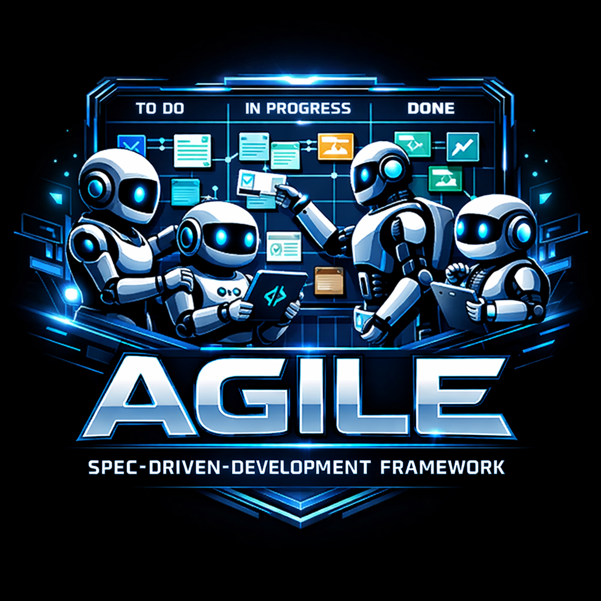
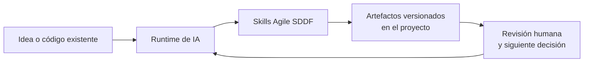
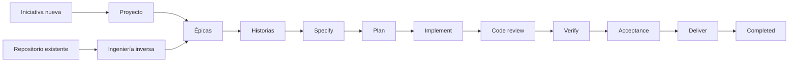

<p align="center">
  
</p>

# Agile SDDF — Spec-Driven Development Framework

[](https://npmjs.com/package/agile-sddf)
[](https://github.com/dariopalminio/agile-sddf/actions/workflows/quality.yml)
[](LICENSE)

Agile SDDF convierte una idea —o un repositorio que ya existe— en especificaciones, épicas, historias, planes y evidencia de calidad versionados junto al código. En lugar de depender de un chat efímero o de prompts improvisados, el equipo y su runtime de IA trabajan sobre artefactos Markdown trazables.

El framework instala skills en el runtime que elijas y conserva la fuente de verdad en tu repositorio. Tú marcas las decisiones y los gates importantes; SDDF estructura el recorrido y deja evidencia de cada fase.

| De un vistazo | Empieza por aquí |
|---|---|
| Instalar el paquete | `npm install agile-sddf` |
| Instalar skills en un runtime | `npx agile-sddf install --target claude-code` |
| Preparar un repositorio | `/sddf-init [--level minimal\|standard\|full]` |
| Empezar una iniciativa | `/project-flow` |
| Entender código existente | `/reverse-engineering` |
| Completar e indexar la memoria del proyecto (`docs/`) | `/memory-system` (`ensure`; `scaffold`, `rebuild --force`, `index`) |
| Verificar que la memoria es consistente (gate de CI) | `/memory-system check [--json]` |
| Profundizar | [Índice de documentación](docs/index.md) |

---

## Índice

**Empezar**

- [Para quién](#para-quien)
- [Qué incluye](#que-incluye)
- [Empieza en cinco minutos](#empieza-en-cinco-minutos)
- [Tu primera historia](#tu-primera-historia-flujo-completo)
- [Si algo se traba](#si-algo-se-traba)

**Entender y extender**

1. [Modelo mental](#modelo-mental)
2. [Flujo y evidencia](#flujo-y-evidencia)
3. [Artefactos que deja el flujo](#artefactos-que-deja-el-flujo-memoria)
4. [Instalación en tu runtime](#installation)
5. [Configuración](#configuracion)
6. [Referencia para profundizar](#referencia-para-profundizar)
7. [Actualizar desde versiones anteriores](#actualizar-desde-versiones-anteriores)
8. [Contribuir](#contribuir)
9. [Seguridad](#seguridad)
10. [Licencia](#licencia)

---

## Para quién

SDDF sirve si:

- Trabajas con un runtime de IA compatible y quieres que el contexto del producto sobreviva a las sesiones de chat.
- Vas a iniciar un producto, convertir un plan en backlog o adoptar un repositorio con código existente.
- Prefieres que requisitos, criterios de aceptación, decisiones técnicas y resultados de calidad sean archivos revisables en Git.
- Quieres combinar autonomía de agentes con gates explícitos de revisión humana, WIP controlado y trazabilidad.

No es:

- Una librería que se importa dentro de tu aplicación.
- Un reemplazo de tu runtime de IA, de Git, de tu stack de pruebas ni del criterio de tu equipo.
- Un generador que elimine decisiones de producto o arquitectura: SDDF las hace visibles y las lleva a los documentos que corresponden.

## Qué incluye

| Pieza | Dónde vive | Para qué sirve |
|---|---|---|
| Skills del framework | `skills/` | Guían los flujos de proyecto, épicas, historias, planificación, implementación y verificación. |
| Agentes declarativos | `agents/` | Aportan especialización cuando el runtime destino admite agentes Markdown. |
| Instalador y contratos | `scripts/` y `config/` | Copian solo los artefactos admitidos en el runtime elegido y validan sus contratos. |
| Configuración del proyecto | `sddf.config.yaml` | Define la raíz de artefactos, perfil, stack, comandos de verificación y workers opcionales. |
| Memoria | `<SPECS_BASE>` | Generalmente docs. Dominio, historial y otros artefactos generados por el flujo. |
| Políticas del proyecto | `<SPECS_BASE>/policies/` | Registran principios técnicos y Definition of Done para los gates del flujo. |
| Especificaciones vivas | `<SPECS_BASE>/specs/` | Conservan intención, requisitos, épicas, historias, planes y reportes. |
## Empieza en cinco minutos

Necesitas Node.js 18 o superior y uno de los runtimes compatibles. La instalación tiene dos pasos deliberadamente separados: descargar el paquete y copiar sus artefactos en el runtime.

### 1. Instala el paquete y elige un runtime

```bash
npm install agile-sddf
npx agile-sddf install --target claude-code
```

El segundo comando es explícito a propósito: `npm install` no crea directorios de runtime ni instala skills por sí solo. Consulta [Instalación en tu runtime](#installation) para elegir otro destino.

### 2. Inicializa SDDF dentro de tu repositorio

Abre el repositorio con tu runtime de IA e invoca:

```text
/sddf-init
```

Es idempotente: prepara `specs/`, templates compartidos, `sddf.config.yaml` y `.env.template` sin sobrescribir lo que ya existe. También puede inicializar las políticas del proyecto si decides hacerlo.

Con `--level` eliges el alcance: `minimal` (solo directorios base, `sddf.config.yaml` y `.env.template`, sin preguntas; útil en CI), `standard` (el valor por defecto, descrito arriba) o `full` (recomendado para proyectos nuevos: `standard` más `/memory-system scaffold`, que completa las capas de la memoria del proyecto en el mismo comando).

### 3. Elige el punto de entrada que se parece a tu situación

| Situación | Invoca | Qué obtienes |
|---|---|---|
| Una iniciativa nueva | `/project-flow` | Intención, discovery de requisitos y plan de épicas con gates entre fases. |
| Un repositorio con código | `/reverse-engineering` | Una especificación de proyecto basada en análisis paralelo del código y la documentación existente. |
| Un plan ya aprobado | `/epic-from-project-plan` | Directorios de épica a partir de `project-plan.md`. |
| Una necesidad puntual | `/story-specify` | Una historia refinada con criterios Gherkin y evaluación FINVEST. |

> `/skill-preflight` es un diagnóstico explícito y de solo lectura. Úsalo bajo demanda para inspeccionar la raíz efectiva, la estructura y los templates; no forma parte de los flujos normales.

## Tu primera historia (flujo completo)

Cuando ya existe un `project-plan.md`, el camino habitual es este:

```text
/epic-from-project-plan
        ↓
/epic-generate-stories EPIC-01-mi-epica
        ↓
/story-specify
        ↓
/story-plan STORY-001
        ↓
/story-implement STORY-001
        ↓
/story-code-review → /story-verify → /story-acceptance
```

Cada etapa produce algo que se puede leer y revisar:

| Etapa | Skill principal | Evidencia principal |
|---|---|---|
| Especificar | `/story-specify` | `story.md`, evaluación FINVEST y, si corresponde, mejora o división de la historia. |
| Planificar | `/story-plan` | `design.md`, `tasks.md`, `testcases.md` y `analyze.md`. |
| Implementar | `/story-implement` | Ciclo TDD configurable RED → GREEN → REFACTOR e `implement-report.md`. |
| Revisar | `/story-code-review` | `code-review-report.md` o `fix-directives.md` si hay correcciones pendientes. |
| Verificar y aceptar | `/story-verify` y `/story-acceptance` | `verify-report.md` y `acceptance-report.md`. |

`/story-implement` orquesta el ciclo TDD y los workers configurados para tu stack. Si necesitas ejecutar una historia tarea por tarea en el flujo SDD, usa `/story-implement-tasks`.

> **Para generar tests y código mediante workers:** el perfil `core` inicializa esas entradas como `skill: none`. Instala workers propios o de [agile-sddf-extension](https://github.com/dariopalminio/agile-sddf-extension) y decláralos en `sddf.config.yaml` antes de pedir esa delegación; sin ellos, `/story-implement` no tiene generadores que invocar.

## Si algo se traba

| Síntoma | Qué revisar |
|---|---|
| “Instalé el paquete y no aparecen los skills” | Es esperado tras `npm install`. Ejecuta `npx agile-sddf install --target <runtime>`. |
| El skill no puede resolver `SPECS_BASE` | Comprueba `SDDF_ROOT`, luego `sddf.config.yaml.root`, o consulta el diagnóstico `/skill-preflight`. Una ruta explícita inválida bloquea las escrituras. |
| Un worker de implementación no existe | Decláralo como `skill: none` o instálalo y configúralo antes de invocar `/story-implement`; los workers requeridos fallan rápido. |
| Una historia necesita correcciones tras el review | Lee `fix-directives.md` y vuelve a `/story-implement`; el artefacto señala la ronda de rework. |
| Quieres retomar trabajo pendiente | Localiza el documento con `substatus: IN-PROGRESS` y reanuda el skill que generó el artefacto. |
| Estás usando Codex | Usa `--target codex`, no `--target .agents`: este último no es un target válido. |

---

## Modelo mental

SDDF separa el kit distribuido, la instalación del runtime y los artefactos de cada proyecto. La conversación activa ayuda a avanzar, pero los archivos versionados son la fuente de verdad que heredan las siguientes sesiones.



| Capa | Responsabilidad | Fuente de verdad |
|---|---|---|
| Paquete SDDF | Distribuye skills, agentes, scripts y contratos. | Este repositorio y el paquete npm. |
| Runtime instalado | Hace disponibles los artefactos compatibles para tu asistente de IA. | El target elegido en [`config/runtimes.json`](config/runtimes.json). |
| Memoria | Guarda la intención, el diseño, las decisiones, la evidencia, las políticas y los specs. | `<SPECS_BASE>/` dentro de tu repositorio. |

## Flujo y evidencia

El framework organiza el trabajo por niveles, no por una secuencia de prompts aislados. Puedes entrar desde una idea o desde el código, pero todas las rutas convergen en artefactos revisables.



| Nivel | Objetivo | Entrada frecuente | Salidas observables |
|---|---|---|---|
| Proyecto (L3) | Entender qué se construye y por qué (Producto/proyecto). | `/project-flow` | `project-intent.md`, `project.md`, `project-plan.md`. |
| Épica (L2) | Agrupar una parte entregable del plan (conjunto de historias). | `/epic-from-project-plan` | `epic.md`. |
| Historia (L1) | Definir, planificar, construir y validar un cambio pequeño. | `/story-specify` | Historia, diseño, tareas, tests, reportes y aceptación. |

El ciclo de vida de una historia es `SPECIFY → PLAN → READY-FOR-IMPLEMENT → IMPLEMENT → CODE-REVIEW → VERIFY → ACCEPTANCE → DELIVER → COMPLETED`. `DELIVER` es una transición de entrega humana o de CI; no corresponde a un skill independiente. Los estados y subestados canónicos están documentados en el [ciclo de vida de historias](docs/domains/domain-story-lifecycle.md).

## Artefactos que deja el flujo (Memoria)

`SPECS_BASE` se resuelve con esta precedencia: `SDDF_ROOT` válida → `sddf.config.yaml.root` válida → `docs`. Una fuente explícita inválida no cae silenciosamente en `docs`: detiene la escritura para proteger el proyecto.

```text
<SPECS_BASE>/
├── constitution.md
├── adr/
├── architecture/
├── domain/
├── templates/
├── guardrails/
│   ├── gr-*-checklist.md
│   └── dod-story-checklist.md
├── policies/
│   └── README.md
└── specs/
    ├── 01-projects/
    │    └── PROJ-01-mi-proyecto/
    │        ├── project-intent.md
    │        ├── project.md
    │        └── project-plan.md
    ├── 02-epics/
    │   └── EPIC-01-mi-epica/
    │       └── epic.md
    └── 03-stories/
        └── STORY-001-mi-historia/
            ├── story.md
            ├── design.md
            ├── tasks.md
            ├── testcases.md
            ├── implement-report.md
            ├── code-review-report.md
            ├── verify-report.md
            └── acceptance-report.md

```

No todos los reportes existen desde el comienzo: aparecen cuando el flujo llega a su fase. El árbol también puede incluir `analyze.md`, `finvest-evaluation-report.md`, `story-improvement-log.md` y `fix-directives.md`.

`/memory-system` (modo `ensure`, recomendado tras `/sddf-init`) crea las once capas de esa memoria que falten (`constitution.md`, `product/*`, un `README.md` por capa y las seis plantillas de `templates/`) sin sobrescribir nada y regenera el índice; `scaffold` solo crea lo faltante, `rebuild --force` restaura los archivos semilla (única operación que sobrescribe, y solo esos archivos; nunca borra) e `index` regenera únicamente `<SPECS_BASE>/index.md`, el mapa de la memoria, con un wikilink `[[slug]]` por artefacto agrupado por capa (idempotente; `--dry-run` solo imprime). `check [--json]` no escribe nada: verifica capas ausentes, nodos sin frontmatter, frontmatter incompleto (`type`, `slug`, `title`; más `id` y `status` en specs) y wikilinks que no resuelven, e informa por texto o con un único objeto JSON, terminando con exit 0 si la memoria está sana, 1 si hay problemas y 2 ante un error técnico — el gate que un pipeline de CI ejecuta en una línea (ejemplo en `docs/guides/sddf-commands-pipeline.md` §0; complementa `npm run verify:links`, no lo sustituye). `docs-wiki-builder` queda como alias deprecado desde 3.3.0 y se elimina en 4.0.0.

**Compatibilidad con OpenSpec y Speckit.** Si tu proyecto ya usa Speckit (`.specify/`) u OpenSpec (`openspec/`), `memory-system` adapta la memoria al harness en lugar de duplicarlo: no crea `docs/specs/` (el harness ya modela las especificaciones), reutiliza `.specify/memory/constitution.md` en lugar de crear `docs/constitution.md` si existe, y enlaza los artefactos del harness desde `docs/index.md` en una sección de artefactos externos. Los directorios del harness son de solo lectura. Para adoptarla:

```text
/memory-system migrate --harness speckit     # propone el plan y escribe solo tras confirmar
/memory-system ensure --harness openspec     # crea las capas bajo docs/ sin tocar openspec/ e indexa sus specs y changes
```

## Qué decide SDDF y qué decides tú

| SDDF aporta | Tu proyecto define |
|---|---|
| Convenciones de artefactos, estados, trazabilidad y gates. | El problema, el dominio, las prioridades y los criterios de aceptación. |
| Un camino para proyecto, épicas e historias. | El stack, la arquitectura y los comandos reales de prueba. |
| Políticas versionadas y control WIP por nivel de flujo. | El contenido de `constitution.md` y `dod-story-checklist.md`. |
| Orquestación de TDD configurable por workers. | Qué workers instalar y declarar en `sddf.config.yaml`. |

Genera o actualiza las políticas cuando el equipo las necesite:

```text
/project-policies-generation
```

---

## Installation

La instalación requiere Node.js `>=18`. Primero instala el paquete; después ejecuta el CLI con un target explícito. Los IDs, rutas y compatibilidades se derivan de [`config/runtimes.json`](config/runtimes.json), que es el contrato vigente.

```bash
npm install agile-sddf
npx agile-sddf install --target claude-code
```

<!-- runtime-contract:start -->
| Runtime | `--target` | Destino local | Destino global |
|---|---|---|---|
| Claude Code | `claude-code` | `.claude/` | `~/.claude/` |
| OpenCode | `opencode` | `.opencode/` | `~/.config/opencode/` |
| GitHub Copilot | `github-copilot` | `.github/` | `~/.copilot/` |
| Codex | `codex` | `.agents/` | `~/.agents/` |
<!-- runtime-contract:end -->

Claude Code, OpenCode y GitHub Copilot reciben skills y agentes que admite su contrato. Para nuevas instalaciones usa los IDs canónicos; los aliases de migración `.claude`, `.opencode` y `.github` siguen aceptándose, pero no son destinos adicionales.

### Codex: solo skills

```bash
npx agile-sddf install --target codex
```

Codex recibe solo skills en `.agents/skills`. El instalador no copia ni convierte los archivos de `agents/` a subagentes de Codex; si los necesitas, defínelos y regístralos por separado según la configuración de Codex.

Usa `--target codex`, no `--target .agents`: `.agents` es un destino y `--target .agents` no es un target válido.

### Variantes útiles

```bash
# Ver targets y rutas reconocidos
npx agile-sddf help

# Actualizar una instalación existente
npx agile-sddf install --target claude-code --force

# Instalar globalmente en el runtime elegido
npm install -g agile-sddf
agile-sddf install --global --target claude-code
```

En un monorepo con pnpm, instala el paquete en la raíz del workspace y ejecuta el mismo target de forma explícita:

```bash
pnpm add -w agile-sddf
pnpm exec agile-sddf install --target claude-code
```

## Configuración

`/sddf-init` crea una configuración de consumidor segura por defecto: `profile: core`, `stack: node-markdown` y `root: docs`. El archivo `sddf.config.yaml` permite adaptar comandos de verificación y workers sin cambiar los skills core.

```yaml
root: docs
profile: core
stack: node-markdown

implement:
  test_generators:
    - type: unit
      skill: none
      required: false
  code_generators:
    - layer: monolithic
      skill: none
      required: false
```

| Concepto | Cómo funciona |
|---|---|
| Raíz de artefactos | `SDDF_ROOT` es un override temporal válido; después se consulta `root` en `sddf.config.yaml`; sin fuente explícita se usa `docs`. |
| Perfil `core` | Es el perfil distribuido por defecto y no exige extensiones de autoría. |
| Perfil `dogfood` | Está reservado para el desarrollo de este repositorio y requiere workers provisionados de forma explícita. |
| Workers por stack | Son opcionales y se declaran en `implement.test_generators` y `implement.code_generators`. `skill: none` los desactiva. |

Los perfiles seleccionan un stack; no son otra modalidad de instalación. El detalle del contrato está en [`config/profiles.json`](config/profiles.json) y en el [ADR de perfiles, runtimes e instalación explícita](docs/adr/ADR-0009-perfiles-runtimes-e-instalacion-explicita.md).

Para usar workers específicos de tecnología, instálalos y decláralos de forma consciente. El core permanece agnóstico al stack; la lista e instrucciones vigentes de workers viven en [agile-sddf-extension](https://github.com/dariopalminio/agile-sddf-extension).

## Referencia para profundizar

El README te orienta; la documentación versionada contiene el detalle operativo.

| Si quieres… | Consulta |
|---|---|
| Entender el enfoque Spec-Driven Development | [Guía de SDD](docs/guides/sdd.md) |
| Navegar toda la documentación del repositorio | [Índice de documentación](docs/index.md) |
| Ver los flujos y comandos principales | [Guía de pipeline SDDF](docs/guides/sddf-commands-pipeline.md) |
| Entender la raíz de artefactos | [Prácticas de resolución de raíz](docs/guides/root-folder-practices.md) |
| Consultar estados, gates y rework | [Ciclo de vida de historias](docs/domains/domain-story-lifecycle.md) |
| Diseñar habilidades o delegación entre agentes | [Buenas prácticas para skills](docs/guides/best-practices-for-skills.md) |
| Ver cambios de versión | [CHANGELOG](CHANGELOG.md) |

---

<a id="upgrading-desde-1x"></a>

## Actualizar desde versiones anteriores

### Desde 2.x a 3.x

La línea 3.x eliminó la copia automática de `postinstall`. Tras actualizar el paquete, reinstala explícitamente los artefactos del runtime:

```bash
npx agile-sddf install --target <runtime>
```

Usa `--force` si necesitas sobrescribir una instalación previa.

<details>
<summary>Migración histórica desde 1.x</summary>

La versión 2.0.0 cambió el nivel intermedio de `release` a `epic`, numeró los directorios de specs y normalizó el prefijo de historias. Si partes desde 1.x, haz un commit de respaldo antes de modificar el árbol.

| Antes (1.x) | Después (2.x+) |
|---|---|
| `docs/specs/projects/` | `docs/specs/01-projects/` |
| `docs/specs/releases/` | `docs/specs/02-epics/` |
| `docs/specs/stories/` | `docs/specs/03-stories/` |
| `release.md` / `type: release` | `epic.md` / `type: epic` |
| `FEAT-NNN-<slug>/` | `STORY-NNN-<slug>/` |

Después de renombrar los directorios y referencias internas:

1. Conserva el número de cada historia al pasar de `FEAT-NNN` a `STORY-NNN`.
2. Añade o revisa el campo `kind` de cada historia (`feat`, `fix`, `chore` u `hotfix`).
3. Elimina a mano skills `release-*` y templates históricos que queden huérfanos: el instalador copia, pero no borra artefactos obsoletos.
4. Reinstala con `npx agile-sddf install --target <runtime> --force`.

| Skill anterior | Skill actual |
|---|---|
| `/release-creation` | `/epic-creation` |
| `/release-format-validation` | `/epic-format-validation` |
| `/releases-from-project-plan` | `/epic-from-project-plan` |
| `/release-generate-stories` | `/epic-generate-stories` |
| `/release-generate-all-stories` | `/epic-generate-all-stories` |

La motivación y el historial completo están en [CHANGELOG](CHANGELOG.md) y en los ADR [0004](docs/adr/ADR-0004-nivel-l2-epic-y-directorios-numerados.md) y [0005](docs/adr/ADR-0005-prefijo-story-para-el-nivel-l1.md).

</details>

## Contribuir

El repositorio contiene la fuente de verdad de skills, agentes, contratos y documentación. Para preparar un cambio:

```bash
git clone https://github.com/dariopalminio/agile-sddf.git
cd agile-sddf
npm ci
npm run test:eval:runner
npm run verify:runtimes
npm run verify:links
```

Mantén la documentación, los contratos y los tests alineados con cualquier cambio de comportamiento. Antes de abrir un Pull Request, revisa también la [constitución del proyecto](docs/constitution.md) y el [Definition of Done](docs/guardrails/dod-story-checklist.md).

## Seguridad

No publiques vulnerabilidades en un issue. Sigue el proceso descrito en [SECURITY.md](SECURITY.md).

## Licencia

Este proyecto se distribuye bajo la [licencia MIT](LICENSE).
