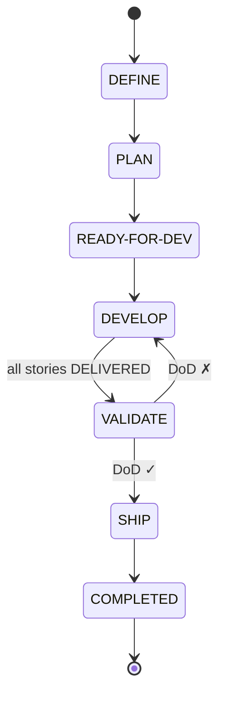

# Documentación del Dominio: Ciclo de Vida de Epic (Epic Lifecycle)

> **Bounded Context:** Epic Lifecycle  
> **Nivel:** L2 — Entregable / Release  
> **Dominio transversal:** [[domain-state-management]]  
> **Fuente canónica de transiciones:** [[state-machine]]  
> **Workflow narrativo:** [[specs-and-workflows]]

---

## 1. Visión General

* **Nombre del dominio:** Ciclo de Vida de Epic
* **Objetivo del sistema:** Gobernar el ciclo de vida completo de una épica —entregable o release que agrupa múltiples historias de usuario—, desde su definición hasta su cierre administrativo, garantizando que el conjunto de historias se desarrolle, valide y libere de forma coordinada.
* **Principales actores:**
  * **PM / PO** — Define el alcance, prioriza historias y acepta el valor del entregable.
  * **Equipo de desarrollo** — Desarrolla las historias que componen la épica.
  * **QA / Equipo** — Ejecuta las pruebas de integración y regresión del conjunto.
  * **DevOps / CI-CD** — Despliega o publica la épica en producción.
  * **Sistema** — Coordina el pipeline y aplica reglas de WIP.
* **Bounded Contexts relacionados:**
  * **State Management** — Modelo transversal de estados, subestados y transiciones.
  * **Story Lifecycle** — Una épica contiene múltiples historias de usuario.
  * **Project Lifecycle** — Nivel superior del proyecto.
* **Alcance de este documento:** estados específicos, subestados, pipeline, máquina de estados, invariantes, gates y trazabilidad **exclusivos del nivel Epic**.

---

## 2. Lenguaje Ubicuo (Glosario)

* **Epic:** Entregable o release que agrupa múltiples historias de usuario. Identificada por `EPIC-NNN`.
* **Pipeline Epic:** Secuencia canónica de estados que recorre una épica: `DEFINE → PLAN → READY-FOR-DEV → DEVELOP → VALIDATE → SHIP → COMPLETED`.
* **Buffer (READY-FOR-DEV):** Estado de cola que desacopla planificación de desarrollo, con WIP limitado.
* **Historia:** Unidad de trabajo atómica que compone la épica (`STORY-NNN`).
* **Gate de Calidad:** Validación estructural de `epic.md` antes de generar sus historias.
* **Release:** Publicación de la épica en un artefacto (npm, Docker, APK, etc.) o despliegue a producción.
* **DoD de Épica:** Criterios que una épica debe cumplir para avanzar al estado terminal.

---

## 3. Modelo Táctico

### Entidades vs. Objetos de Valor

| Elemento | Tipo (Entidad/VO) | ¿Por qué? (Identidad/Inmutabilidad) |
| :--- | :--- | :--- |
| `Epic` | Entidad | Tiene identidad única (`EPIC-001`) que la rastrea a lo largo de su ciclo de vida. Su estado cambia con el tiempo. |
| `EpicArtifact` | Entidad | Documento asociado (`epic.md`) con identidad por ruta. |
| `EpicStatus` | Objeto de Valor | Inmutable. Conjunto cerrado de 7 estados específicos del nivel Epic. |
| `EpicSubstatus` | Objeto de Valor | Inmutable. Heredado del dominio transversal: `TODO`, `IN-PROGRESS`, `DONE`, `BLOCKED`. |
| `StoryRef` | Objeto de Valor | Inmutable. Referencia a una historia contenida (`STORY-NNN`). |
| `ReleaseArtifact` | Objeto de Valor | Inmutable. Se define por nombre, versión y destino (npm, Docker, etc.). |
| `EpicParent` | Objeto de Valor | Inmutable. Referencia al `Project` contenedor (`PROJ-NNN`). |

### Agregado y Aggregate Root (AR)

* **Agregado Principal:** `Epic` (AR)
* **Contenido interno:**
  * `EpicStatus` (VO)
  * `EpicSubstatus` (VO)
  * `EpicArtifact` (Entidad) — `epic.md` como artefacto principal
  * `StoryRef` (VO) — colección de historias que componen la épica
  * `ReleaseArtifact` (VO) — artefacto publicado en `SHIP`
  * `EpicParent` (VO) — referencia al proyecto contenedor
  * `WipLimit` (VO) — aplicable solo en `READY-FOR-DEV`

---

## 4. Pipeline de Estados

### 4.1 Happy path

```
DEFINE → PLAN → READY-FOR-DEV → DEVELOP → VALIDATE → SHIP → COMPLETED
```

### 4.2 Máquina de estados completa



### 4.3 Rutas alternativas

| Ruta | Descripción |
|------|-------------|
| **Happy path** | `DEFINE → PLAN → RFD → DEVELOP → VALIDATE → SHIP → COMPLETED` |
| **Rework por validación** | `VALIDATE → DEVELOP` (DoD ✗) — las historias con problemas regresan a su propio pipeline |
| **Cancelación** | `* → CANCELED` (desde cualquier estado activo) |

---

## 5. Tabla de Estados

| Status | Descripción | Actor | Substatus inicial |
|--------|-------------|-------|-------------------|
| `DEFINE` | Se define el alcance: objetivos de alto nivel, features que componen la épica, criterios de éxito y valor esperado. Se documenta en `epic.md`. | PM / PO | `IN-PROGRESS` |
| `PLAN` | Se planifica la ejecución: se desglosan las historias de usuario, se asignan a la épica, se estima esfuerzo y se identifican dependencias. | PM / Equipo | `IN-PROGRESS` |
| `READY-FOR-DEV` | Buffer/cola. Épica completamente planificada, priorizada y aprobada. Espera capacidad del equipo. Aplica límite WIP. | Sistema | `DONE` |
| `DEVELOP` | Desarrollo en curso: las historias de la épica se implementan siguiendo su propio ciclo de vida. La épica permanece aquí hasta que todas las historias estén en `DELIVER`. | Equipo | `IN-PROGRESS` |
| `VALIDATE` | Pruebas de integración y regresión del conjunto completo: end-to-end, UAT, requisitos no funcionales. | QA / Equipo | `IN-PROGRESS` |
| `SHIP` | La épica se publica o despliega a producción. Último estado activo. | DevOps / CI-CD | `IN-PROGRESS` |
| `COMPLETED` | Estado terminal pasivo. Épica cerrada administrativamente. Sin acciones pendientes. Permite medir tiempos de ciclo sin reabrir artefactos. | — | `DONE` |
| `CANCELED` | La épica fue cancelada sin entregar. Estado terminal. | PM / PO | `DONE` |

---

## 6. Subestados Aplicables

| Substatus | Aplica en | Significado específico en Epic |
|-----------|-----------|--------------------------------|
| `TODO` | `READY-FOR-DEV` | Épica en cola, esperando capacidad del equipo. |
| `IN-PROGRESS` | `DEFINE`, `PLAN`, `DEVELOP`, `VALIDATE`, `SHIP` | El rol correspondiente está trabajando activamente. |
| `DONE` | Todos los estados activos | El trabajo del estado ha terminado y la épica está lista para avanzar. |
| `BLOCKED` | Cualquier estado activo | Impedimento externo (ej. dependencia, decisión pendiente). No retrocede el status. |

---

## 7. Invariantes Específicas de Epic

Además de las invariantes transversales de [[domain-state-management]]:

1. Una `Epic` **siempre pertenece a un `Project`** (`parent: PROJ-NNN` en el frontmatter).
2. Una `Epic` contiene **una o más historias** (`StoryRef`). Una épica sin historias no puede pasar de `PLAN` a `READY-FOR-DEV`.
3. El estado `DEVELOP` no puede completarse hasta que **todas las historias de la épica estén en `DELIVER`**.
4. El estado `VALIDATE` solo puede alcanzarse cuando todas las historias están entregadas; en caso de fallo, las historias problemáticas regresan a su pipeline y la épica vuelve a `DEVELOP`.
5. El estado `SHIP` es un **último estado activo**: implica publicación o despliegue real del entregable.
6. El estado `COMPLETED` es terminal pasivo; no retrocede sin acción explícita de reapertura.
7. El `READY-FOR-DEV` debe respetar un **WIP limit** definido en la política del proyecto.
8. El gate de calidad de formato (`epic-format-validation`) debe superarse antes de generar las historias.
9. El estado `COMPLETED` no admite transiciones salientes excepto `CANCELED` o reapertura explícita.

---

## 8. Gates de Calidad Específicos

| Gate | Estado | Qué valida |
|------|--------|------------|
| **Gate de formato** | `DEFINE` → `PLAN` | Estructura del `epic.md` contra el template canónico. |
| **Gate de completitud de historias** | `DEVELOP` → `VALIDATE` | Todas las historias están en `DELIVER`. |
| **Gate de integración** | `VALIDATE` | E2E, regresión, requisitos no funcionales del conjunto. |
| **Gate de aceptación de épica** | `VALIDATE` → `SHIP` | Criterios de éxito y valor de negocio del entregable. |
| **Gate de publicación** | `SHIP` | Artefacto generado correctamente y desplegado. |
| **WIP Limit** | `READY-FOR-DEV` | No exceder el número máximo de épicas en cola. |

---

## 9. Trazabilidad y Persistencia

* **Frontmatter de `epic.md`** con `status`, `substatus`, `parent`, `deliveryModel`.
* **`TransitionHistory`** inmutable con cada cambio de estado (fecha, origen, destino, actor, motivo).
* **`StoryRef`** — trazabilidad bidireccional: cada historia apunta a su épica y la épica lista sus historias.
* **`ReleaseArtifact`** — registra el artefacto publicado (npm, Docker, APK), versión y fecha.
* **Reportes asociados:**
  * `validate-report.md` — generado en `VALIDATE`.
  * `release-notes.md` (opcional) — generado en `SHIP`.
* **Reapertura:** solo desde `COMPLETED` con acción explícita y registro del motivo.
* **Convención de guion:** ASCII U+002D `-`.

---

## 10. Fuentes de Verdad

* **Esquema canónico de frontmatter:** `header-aggregation/SKILL.md`
* **Máquina de estados completa:** [[state-machine]]
* **Workflow narrativo:** [[specs-and-workflows]]
* **Dominio transversal:** [[domain-state-management]]
* **Principios aplicables:** [[constitution]] (patrones 8, 14; reglas 9 y 15)
* **Decisión de arquitectura:** [[ADR-0003]] — rationale de los workflows canónicos de story y epic

---

## 11. Referencias Cruzadas

* [[domain-state-management]] — Modelo transversal de estados y transiciones
* [[domain-story-lifecycle]] — Ciclo de vida de Story (contenido de la Epic)
* [[domain-project-lifecycle]] — Ciclo de vida de Project (contenedor de Epic)
* [[constitution]] — Constitución del proyecto
* [[ADR-0003]] — Workflow canónico de story y epic