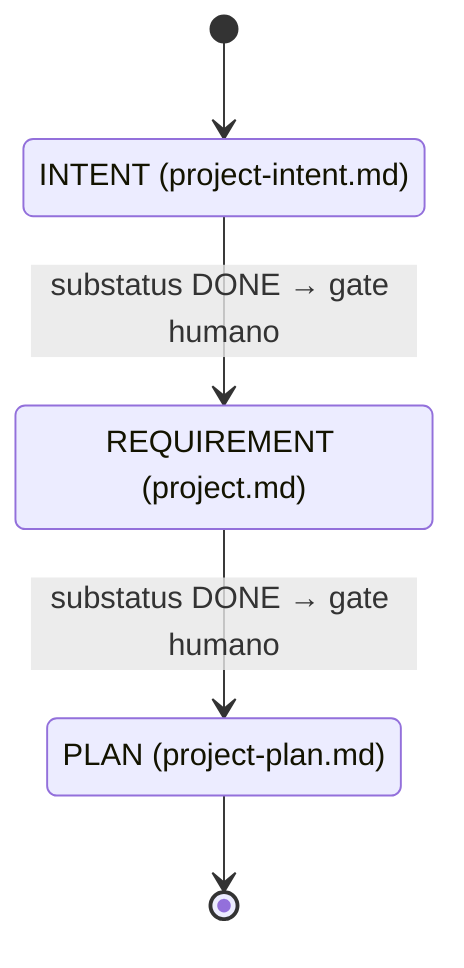

# Documentación del Dominio: Ciclo de Vida de Project (Project Lifecycle)

> **Bounded Context:** Project Lifecycle  
> **Nivel:** L3 — Documentación del proyecto  
> **Dominio transversal:** [[domain-state-management]]  
> **Fuente canónica de transiciones:** [[state-machine]]  
> **Workflow narrativo:** [[specs-and-workflows]]

---

## 1. Visión General

* **Nombre del dominio:** Ciclo de Vida de Project
* **Objetivo del sistema:** Gobernar la producción secuencial de los documentos fundacionales del proyecto —intención, especificación de requisitos y plan— mediante una secuencia estricta de fases con gates humanos, garantizando que cada artefacto esté completo antes de iniciar el siguiente.
* **Principales actores:**
  * **PO / PM** — Conduce la captura de intención y valida cada documento antes de avanzar.
  * **Equipo** — Colabora en la especificación de requisitos y el plan.
  * **Revisor** — Ejecuta la validación de cada documento en el gate humano.
  * **Sistema** — Aplica la regla de WIP = 1 y coordina las transiciones entre documentos.
* **Bounded Contexts relacionados:**
  * **State Management** — Modelo transversal de estados, subestados y transiciones.
  * **Epic Lifecycle** — Una vez definido el plan, se generan épicas a partir de él.
  * **Story Lifecycle** — Nivel inferior, derivado de las épicas.
* **Alcance de este documento:** estructura de documentos, subestados aplicables, secuencia de fases, gates humanos, invariantes y trazabilidad **exclusivos del nivel Project**.

> **Particularidad de este nivel:** el Project **no usa `status`**. Solo opera con `substatus` (`TODO`, `IN-PROGRESS`, `DONE`, `BLOCKED`). La secuencia de avance está gobernada por la finalización de cada documento y el gate humano que le sigue.

---

## 2. Lenguaje Ubicuo (Glosario)

* **Project:** Nivel superior del framework SDDF. Representa el proyecto completo y su documentación fundacional. Identificado por `PROJ-NNN`.
* **Documento fundacional:** Cada uno de los tres artefactos secuenciales del nivel Project:
  * `project-intent.md` — Visión, objetivos, alcance y restricciones.
  * `project.md` (requirement-spec) — Requisitos funcionales y no funcionales.
  * `project-plan.md` — Plan de releases y desglose de épicas.
* **Gate humano:** Punto de control obligatorio donde una persona valida el documento completo antes de permitir el inicio del siguiente.
* **WIP = 1:** Regla que establece que **solo un documento fundacional** puede tener `substatus: IN-PROGRESS` a la vez.
* **Fase:** Cada etapa del nivel Project, asociada a un documento fundacional. Hay tres fases secuenciales.
* **Documento activo:** El documento que actualmente tiene `substatus: IN-PROGRESS`. Solo puede haber uno.

---

## 3. Modelo Táctico

### Entidades vs. Objetos de Valor

| Elemento | Tipo (Entidad/VO) | ¿Por qué? (Identidad/Inmutabilidad) |
| :--- | :--- | :--- |
| `Project` | Entidad | Tiene identidad única (`PROJ-001`) que lo rastrea a lo largo de su ciclo de vida. |
| `FoundationalDocument` | Entidad | Cada uno de los tres documentos fundacionales, con identidad por ruta (`project-intent.md`, `project.md`, `project-plan.md`). |
| `ProjectSubstatus` | Objeto de Valor | Inmutable. Heredado del dominio transversal: `TODO`, `IN-PROGRESS`, `DONE`, `BLOCKED`. |
| `ProjectPhase` | Objeto de Valor | Inmutable. Conjunto cerrado de 3 fases: `INTENT`, `REQUIREMENT`, `PLAN`. |
| `HumanGate` | Objeto de Valor | Inmutable. Se define por el documento que lo precede, el documento que lo sigue y el actor responsable. |
| `WipConstraint` | Objeto de Valor | Inmutable. Regla de WIP = 1 aplicable a los documentos fundacionales. |

### Agregado y Aggregate Root (AR)

* **Agregado Principal:** `Project` (AR)
* **Contenido interno:**
  * `FoundationalDocument` (Entidad) — `project-intent.md`
  * `FoundationalDocument` (Entidad) — `project.md` (requirement-spec)
  * `FoundationalDocument` (Entidad) — `project-plan.md`
  * `ProjectSubstatus` (VO) — por documento
  * `ProjectPhase` (VO) — fase activa
  * `HumanGate` (VO) — gate entre cada par de documentos
  * `WipConstraint` (VO) — WIP = 1

---

## 4. Pipeline de Fases

### 4.1 Secuencia canónica

```
INTENT → REQUIREMENT → PLAN
```

Cada fase corresponde a un documento fundacional:

| Fase | Documento | Propósito |
|------|-----------|-----------|
| `INTENT` | `project-intent.md` | Visión, objetivos, alcance y restricciones del proyecto. |
| `REQUIREMENT` | `project.md` (requirement-spec) | Requisitos funcionales y no funcionales. |
| `PLAN` | `project-plan.md` | Plan de releases y desglose de épicas. |

### 4.2 Diagrama de estados



Cada documento transita `substatus: IN-PROGRESS → DONE` dentro de su fase. La transición a la siguiente fase requiere:
1. `substatus: DONE` en el documento actual.
2. Gate humano aprobado.
3. Inicio del siguiente documento con `substatus: IN-PROGRESS`.

### 4.3 Rutas alternativas

| Ruta | Descripción |
|------|-------------|
| **Happy path** | `INTENT → REQUIREMENT → PLAN` (con gates humanos entre cada fase) |
| **Rework en fase** | Dentro de una fase, el documento puede pasar de `IN-PROGRESS` a `BLOCKED` y de `BLOCKED` de nuevo a `IN-PROGRESS`. |
| **Rechazo en gate** | El gate humano puede rechazar el documento, devolviéndolo a `IN-PROGRESS` para corrección. |
| **Cancelación** | `* → CANCELED` (desde cualquier fase activa). |

---

## 5. Tabla de Fases y Documentos

| Fase | Documento | Descripción | Actor | Substatus inicial |
|------|-----------|-------------|-------|-------------------|
| `INTENT` | `project-intent.md` | Se captura la visión, objetivos de alto nivel, alcance preliminar y restricciones conocidas del proyecto. | PO / PM | `IN-PROGRESS` |
| `REQUIREMENT` | `project.md` (requirement-spec) | Se especifican los requisitos funcionales y no funcionales, perfiles de usuario y reglas de negocio. | Equipo / PO | `IN-PROGRESS` |
| `PLAN` | `project-plan.md` | Se desglosan las épicas, se planifican releases y se estiman esfuerzos. | PM / Equipo | `IN-PROGRESS` |

> **No existe un campo `status` en este nivel.** El avance se mide exclusivamente por el `substatus` de cada documento.

---

## 6. Subestados Aplicables

| Substatus | Significado específico en Project |
|-----------|-----------------------------------|
| `TODO` | El documento aún no ha comenzado a redactarse (fase no iniciada). |
| `IN-PROGRESS` | El documento está siendo redactado activamente. **Solo uno a la vez** (WIP = 1). |
| `DONE` | El documento está completo y listo para el gate humano. |
| `BLOCKED` | El documento no puede avanzar por un impedimento externo (decisión pendiente, información faltante). No cambia de fase. |

---

## 7. Invariantes Específicas de Project

Además de las invariantes transversales de [[domain-state-management]]:

1. El nivel Project **no usa `status`**; solo `substatus`.
2. **WIP = 1:** solo un documento fundacional puede tener `substatus: IN-PROGRESS` a la vez.
3. La secuencia de fases es **estrictamente secuencial**: no se puede iniciar `REQUIREMENT` sin haber completado `INTENT`, ni `PLAN` sin haber completado `REQUIREMENT`.
4. Cada transición de fase requiere un **gate humano** explícito.
5. Un documento en `DONE` no puede retroceder a `IN-PROGRESS` sin un rechazo explícito en el gate humano.
6. Un documento en `BLOCKED` no cambia de fase; permanece en su fase actual mientras espera resolución.
7. El estado terminal del nivel Project se alcanza cuando los tres documentos están en `DONE`.
8. Cada documento fundacional tiene su propio frontmatter con `substatus`, `parent` (null) y metadatos de trazabilidad.

---

## 8. Gates de Calidad Específicos

| Gate | Fase | Qué valida |
|------|------|------------|
| **Gate humano de INTENT** | `INTENT → REQUIREMENT` | Visión clara, objetivos SMART, alcance delimitado, restricciones identificadas. |
| **Gate humano de REQUIREMENT** | `REQUIREMENT → PLAN` | Requisitos funcionales y no funcionales completos, perfiles de usuario definidos, reglas de negocio explícitas. |
| **Gate humano de PLAN** | `PLAN → COMPLETED` | Épicas desglosadas, releases planificados, estimaciones razonables, dependencias identificadas. |
| **WIP constraint** | Todas las fases | Solo un documento en `IN-PROGRESS` a la vez. |

---

## 9. Trazabilidad y Persistencia

* **Frontmatter de cada documento fundacional** con `substatus`, `parent: null`, `created`, `updated`.
* **`TransitionHistory`** inmutable con cada cambio de `substatus` (fecha, origen, destino, actor, motivo).
* **Gate humano registrado** en el propio documento o en un log de auditoría:
  * Fecha del gate.
  * Actor responsable.
  * Resultado (aprobado / rechazado).
  * Comentarios opcionales.
* **Trazabilidad hacia abajo:** `project-plan.md` referencia las épicas generadas (`EPIC-NNN`), que a su vez referencian historias (`STORY-NNN`).
* **Convención de guion:** ASCII U+002D `-`.

---

## 10. Fuentes de Verdad

* **Esquema canónico de frontmatter:** `header-aggregation/SKILL.md`
* **Máquina de estados completa:** [[state-machine]]
* **Workflow narrativo:** [[specs-and-workflows]]
* **Dominio transversal:** [[domain-state-management]]
* **Principios aplicables:** [[constitution]] (patrón 14; regla 9)
* **Decisión de arquitectura:** [[ADR-0003]] — rationale de los workflows canónicos de story y epic

---

## 11. Referencias Cruzadas

* [[domain-state-management]] — Modelo transversal de estados y transiciones
* [[domain-epic-lifecycle]] — Ciclo de vida de Epic (derivado del plan del proyecto)
* [[domain-story-lifecycle]] — Ciclo de vida de Story (derivado de las épicas)
* [[constitution]] — Constitución del proyecto
* [[ADR-0003]] — Workflow canónico de story y epic
