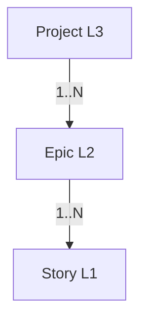

# Documentación del Dominio: Jerarquía de Work Items (Work Item Hierarchy)

> **Bounded Context:** Work Item Hierarchy  
> **Alcance:** Estructura transversal Project → Epic → Story  
> **Dominio relacionado:** [[domain-state-management]]  
> **Fuente canónica de transiciones:** [[state-machine]]  
> **Workflow narrativo:** [[specs-and-workflows]]

---

## 1. Visión General

* **Nombre del dominio:** Jerarquía de Work Items
* **Objetivo del sistema:** Definir de forma canónica la estructura jerárquica de los work items del framework SDDF —Project, Epic y Story—, sus relaciones de parentesco, su cardinalidad, su nomenclatura y su mapeo con los niveles de Flight Levels y con la estructura de carpetas del repositorio.
* **Principales actores:**
  * **PO / PM** — Define y mantiene la jerarquía a nivel de negocio.
  * **Equipo** — Consulta la jerarquía para ubicar su trabajo.
  * **Agentes IA** — Leen la jerarquía para resolver referencias padre-hijo y ubicar artefactos.
  * **Sistema SDDF** — Valida invariantes y aplica reglas de parentesco.
* **Bounded Contexts relacionados:**
  * **State Management** — Modelo transversal de estados y transiciones.
  * **Project Lifecycle** — Ciclo de vida del nivel L3.
  * **Epic Lifecycle** — Ciclo de vida del nivel L2.
  * **Story Lifecycle** — Ciclo de vida del nivel L1.
* **Alcance de este documento:** la estructura jerárquica, las reglas de parentesco, la nomenclatura y los mapeos conceptuales. **No** describe ciclos de vida ni transiciones (esos viven en los dominios de cada nivel).

---

## 2. Lenguaje Ubicuo (Glosario)

* **WorkItem:** Unidad de trabajo gestionada por el framework. Tiene identidad única y pertenece a un nivel.
* **Project:** Work item de nivel L3. Representa el proyecto completo y su documentación fundacional. Identificado por `PROJ-NNN`.
* **Epic:** Work item de nivel L2. Entregable o release que agrupa historias de usuario. Identificada por `EPIC-NNN`.
* **Story:** Work item de nivel L1. Historia de usuario atómica que aporta valor de negocio. Identificada por `STORY-NNN`.
* **Parent:** Work item inmediatamente superior en la jerarquía. Todo work item (excepto `Project`) tiene exactamente un parent.
* **Children:** Work items inmediatamente inferiores. Un work item puede tener cero o más children.
* **Nivel (Level):** Posición del work item en la jerarquía: L3 (Project), L2 (Epic), L1 (Story).
* **Prefijo:** Cadena que precede al identificador numérico y que indica el nivel del work item (`PROJ-`, `EPIC-`, `STORY-`).
* **Slug:** Cadena en kebab-case que acompaña al identificador en la carpeta de un work item (ej. `STORY-001-project-begin`).
* **Cardinalidad:** Regla que define cuántos children puede tener un work item.

---

## 3. Modelo Táctico

### Entidades vs. Objetos de Valor

| Elemento | Tipo (Entidad/VO) | ¿Por qué? (Identidad/Inmutabilidad) |
| :--- | :--- | :--- |
| `WorkItem` | Entidad | Tiene identidad única (`STORY-001`, `EPIC-001`, `PROJ-001`). Cambia de estado, pero no de identidad. |
| `WorkItemId` | Objeto de Valor | Inmutable. Se define por prefijo + número (`STORY-001`). Único globalmente. |
| `Level` | Objeto de Valor | Inmutable. Conjunto cerrado: `L1`, `L2`, `L3`. |
| `ParentRef` | Objeto de Valor | Inmutable. Referencia al `WorkItemId` del parent. Puede ser `null` para el nivel L3. |
| `ChildrenRef` | Objeto de Valor | Inmutable. Colección de referencias a `WorkItemId` de los children. |
| `Slug` | Objeto de Valor | Inmutable. Cadena en kebab-case que acompaña al ID en la carpeta. |
| `FolderSegment` | Objeto de Valor | Inmutable. Segmento de ruta que ubica al work item en el repositorio (`01-projects`, `02-epics`, `03-stories`). |

### Agregado y Aggregate Root (AR)

* **Agregado Principal:** `WorkItem` (AR)
* **Contenido interno:**
  * `WorkItemId` (VO)
  * `Level` (VO)
  * `ParentRef` (VO)
  * `ChildrenRef` (VO)
  * `Slug` (VO)
  * `FolderSegment` (VO)
* **Relación con otros agregados:**
  * Un `WorkItem` de nivel L2 referencia a un `WorkItem` de nivel L3 como parent.
  * Un `WorkItem` de nivel L1 referencia a un `WorkItem` de nivel L2 como parent.
  * La jerarquía se modela como **referencias por ID**, no como anidamiento físico obligatorio.

---

## 4. Estructura Jerárquica

### 4.1 Diagrama de niveles

```
Project (L3)         ──► Documentación fundacional del proyecto
    │
    └── Epic (L2)    ──► Entregable o release que agrupa historias
            │
            └── Story (L1) ──► Historia de usuario atómica
```

### 4.2 Relación de parentesco



* Un `Project` puede tener **cero o más** `Epics`.
* Una `Epic` puede tener **cero o más** `Stories`.
* Una `Epic` **siempre** tiene exactamente un `Project` como parent.
* Una `Story` **siempre** tiene exactamente una `Epic` como parent.
* Un `Project` **no tiene parent**.

### 4.3 Cardinalidad canónica

| Nivel | Parent obligatorio | Número de children | Cardinalidad |
|-------|--------------------|--------------------|--------------|
| **Project (L3)** | ❌ No | 0..N Epics | 1 Project → N Epics |
| **Epic (L2)** | ✅ Sí (1 Project) | 0..N Stories | 1 Epic → N Stories |
| **Story (L1)** | ✅ Sí (1 Epic) | ❌ No aplica (nivel hoja) | N Stories → 1 Epic |

---

## 5. Reglas de Parentesco y Cardinalidad

### 5.1 Invariantes transversales

1. **Unicidad de parent:** todo work item de nivel L2 o L1 tiene **exactamente un parent**.
2. **Cardinalidad:**
   * Un `Project` puede tener **0..N** `Epics`.
   * Una `Epic` puede tener **0..N** `Stories`.
   * Una `Story` **no tiene children** en el modelo actual.
3. **Obligatoriedad del parent:**
   * Una `Epic` **no puede existir sin un `Project`**.
   * Una `Story` **no puede existir sin una `Epic`**.
4. **Integridad referencial:** el `ParentRef` de una `Epic` debe apuntar a un `WorkItemId` válido de nivel L3; el de una `Story`, a uno válido de nivel L2.
5. **Trazabilidad bidireccional:** un `Project` mantiene una lista de sus `Epics`; una `Epic`, de sus `Stories`. Si una referencia se rompe, es un error del modelo.
6. **No se permiten saltos de nivel:** una `Story` no puede tener como parent a un `Project` (si ese caso se necesita, se modela como una `Epic` contenedora).
7. **Eliminación:** un `WorkItem` no puede eliminarse si tiene children activos. Los children deben reasignarse o cancelarse primero.

### 5.2 Representación en frontmatter

Cada work item declara su parent y, opcionalmente, sus children en el frontmatter YAML:

```yaml
---
type: story
id: STORY-001
parent: EPIC-003
---
```

---

## 6. Nomenclatura e Identificadores

### 6.1 Prefijos por nivel

| Nivel | Prefijo | Ejemplo | Descripción |
|-------|---------|---------|-------------|
| **Project (L3)** | `PROJ-` | `PROJ-001` | Identificador único del proyecto. |
| **Epic (L2)** | `EPIC-` | `EPIC-003` | Identificador único de la épica. |
| **Story (L1)** | `STORY-` | `STORY-042` | Identificador único de la historia. |

### 6.2 Reglas de nomenclatura

1. **Unicidad global:** un `WorkItemId` es único en todo el repositorio. No puede repetirse entre niveles.
2. **Formato:** `<PREFIJO>-<NNN>` donde `NNN` es un número secuencial de al menos 3 dígitos (con padding de ceros).
3. **Kebab-case en carpetas:** el nombre de la carpeta combina el ID con un slug derivado del título:
   ```
   <PREFIJO>-<NNN>-<slug-kebab-case>
   ```
   Ejemplo: `STORY-001-project-begin`, `EPIC-003-payment-gateway`.
4. **Sin guiones al inicio/final del slug**, sin espacios, solo `[a-z0-9-]`.
5. **Convención de guion:** ASCII U+002D `-` (no guiones no-ASCII como U+2011).

### 6.3 Ejemplos válidos

| Nivel | ID | Carpeta |
|-------|----|---------|
| Project | `PROJ-001` | `01-projects/PROJ-001-sddf-framework/` |
| Epic | `EPIC-003` | `02-epics/EPIC-003-payment-gateway/` |
| Story | `STORY-042` | `03-stories/STORY-042-add-login-button/` |

---

## 7. Mapeos Conceptuales

### 7.1 Flight Levels (Klaus Leopold)

El framework SDDF alinea su jerarquía con el modelo de **Flight Levels**, que distingue tres niveles de abstracción para la gestión del flujo de valor:

| Flight Level | Nivel SDDF | Propósito | Horizonte típico |
|--------------|------------|-----------|------------------|
| **Flight Level 3 (Estratégico)** | Project (L3) | Definir la estrategia y la documentación fundacional. | Meses |
| **Flight Level 2 (Coordinación)** | Epic (L2) | Coordinar el flujo de trabajo entre equipos; gestionar entregables. | Semanas |
| **Flight Level 1 (Operativo)** | Story (L1) | Ejecutar el trabajo del día a día; producir incrementos. | Días |

**Ventajas del mapeo:**

* **Alineación conceptual:** el framework habla el mismo lenguaje que Flight Levels.
* **Coordinación entre niveles:** las decisiones estratégicas (L3) se traducen en entregables (L2) y en historias (L1).
* **Compatibilidad con Kanban a escala:** el framework puede adoptarse en organizaciones que ya usan Flight Levels.

### 7.2 Estructura de carpetas del repositorio

La jerarquía se refleja en el repositorio mediante **carpetas ordenadas por nivel**, con un prefijo numérico que preserva el orden lógico (L3 → L2 → L1):

| Nivel | Segmento de carpeta | Orden |
|-------|---------------------|-------|
| **Project (L3)** | `01-projects/` | 1 |
| **Epic (L2)** | `02-epics/` | 2 |
| **Story (L1)** | `03-stories/` | 3 |

**Ejemplo de árbol:**

```
docs/specs/
├── 01-projects/
│   └── PROJ-001-sddf-framework/
│       └── project.md
├── 02-epics/
│   └── EPIC-003-payment-gateway/
│       └── epic.md
└── 03-stories/
    └── STORY-042-add-login-button/
        └── story.md
```

**Notas sobre el orden:**

* El prefijo numérico (`01`, `02`, `03`) ordena las carpetas de mayor a menor nivel de abstracción, reflejando la jerarquía.
* El orden **no** implica dependencia física; las relaciones padre-hijo se modelan por referencias (`parent`, `children`), no por anidamiento de carpetas.
* Un work item puede moverse entre releases o proyectos actualizando su `parent`, sin necesidad de mover físicamente su carpeta.

### 7.3 Correspondencia entre los tres mapeos

| Concepto | Nivel | Flight Level | Carpeta |
|----------|-------|--------------|---------|
| **Project** | L3 | Flight Level 3 (Estratégico) | `01-projects/` |
| **Epic** | L2 | Flight Level 2 (Coordinación) | `02-epics/` |
| **Story** | L1 | Flight Level 1 (Operativo) | `03-stories/` |

---

## 8. Trazabilidad Cruzada

### 8.1 De arriba hacia abajo

* Un `Project` puede listar sus `Epics` en su frontmatter o en un índice generado.
* Una `Epic` puede listar sus `Stories` en su frontmatter o en un índice generado.
* Las listas son **referencias por ID**, no anidamiento físico.

### 8.2 De abajo hacia arriba

* Una `Story` declara su `parent: EPIC-NNN`.
* Una `Epic` declara su `parent: PROJ-NNN`.
* Los wikilinks `[[STORY-042]]` permiten navegar entre niveles sin conocer la ruta física.

### 8.3 Navegación por wikilinks

El sistema resuelve un `WorkItemId` a su archivo correspondiente mediante:

1. **Lectura del índice central** (`docs/specs/index.md`) que mapea IDs a rutas.
2. **Búsqueda por ID** en el segmento de carpeta del nivel correspondiente (`01-projects/`, `02-epics/`, `03-stories/`).
3. **Fallback**: si el ID no se encuentra, error explícito.

---

## 9. Invariantes Globales

Además de las invariantes transversales de [[domain-state-management]]:

1. **Unicidad de IDs:** un `WorkItemId` es único globalmente.
2. **Parent obligatorio:** todo `WorkItem` de nivel L2 o L1 tiene un parent.
3. **Parent del nivel correcto:** el parent de una `Epic` es un `Project`; el de una `Story`, una `Epic`.
4. **Sin saltos de nivel:** no se permite que una `Story` tenga como parent un `Project`.
5. **Children opcionales:** un work item puede no tener children (un `Project` sin `Epics`, una `Epic` sin `Stories`).
6. **Integridad referencial:** los `ParentRef` y `ChildrenRef` deben apuntar a IDs existentes.
7. **Sin eliminación de parents con children activos.**
8. **Nomenclatura consistente:** prefijos (`PROJ-`, `EPIC-`, `STORY-`) y slugs en kebab-case.
9. **Convención de guion:** ASCII U+002D `-`.

---

## 10. Fuentes de Verdad

* **Esquema canónico de frontmatter:** `header-aggregation/SKILL.md`
* **Máquina de estados completa:** [[state-machine]]
* **Workflow narrativo:** [[specs-and-workflows]]
* **Dominio transversal de estados:** [[domain-state-management]]
* **Principios aplicables:** [[constitution]] (patrón 14; regla 9)
* **Decisión de arquitectura:** [[ADR-0003]] — rationale de los workflows canónicos de story y epic

---

## 11. Referencias Cruzadas

* [[domain-state-management]] — Modelo transversal de estados y transiciones
* [[domain-project-lifecycle]] — Ciclo de vida del nivel L3
* [[domain-epic-lifecycle]] — Ciclo de vida del nivel L2
* [[domain-story-lifecycle]] — Ciclo de vida del nivel L1
* [[constitution]] — Constitución del proyecto
* [[ADR-0003]] — Workflow canónico de story y epic