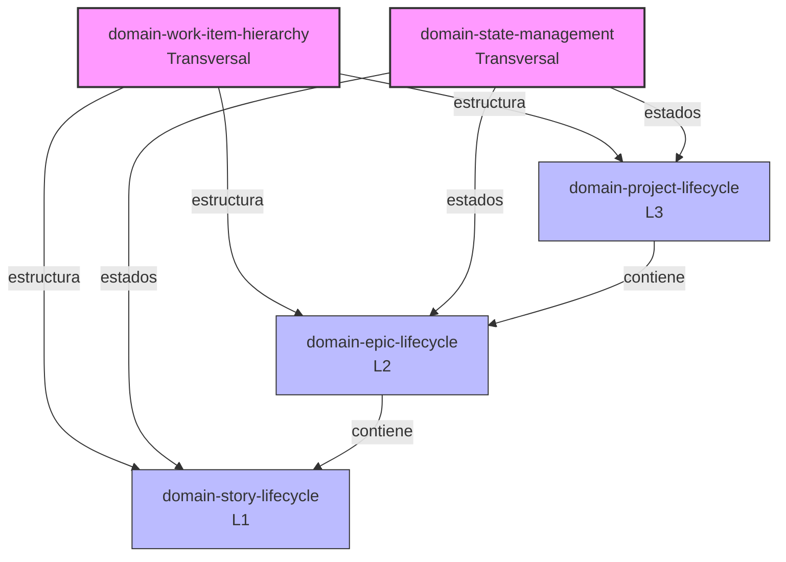

# Documentación de Dominios — Framework SDDF

> **Carpeta:** `docs/domains/`  
> **Propósito:** Documentación DDD (Domain-Driven Design) de los bounded contexts del framework SDDF.  
> **Patrón:** LLM Wiki (Karpathy) — el índice es el cursor principal para humanos y agentes.

---

## 📖 Descripción

Esta carpeta contiene la **documentación de dominio** del framework SDDF, siguiendo los principios de **Domain-Driven Design (DDD)**. Cada documento describe un **bounded context** con su lenguaje ubicuo, modelo táctico (entidades, objetos de valor, agregados), invariantes y reglas de negocio.

La documentación está diseñada para ser **navegable por humanos y agentes IA**, usando wikilinks `[[slug]]` y frontmatter YAML. El objetivo es que un agente pueda leer solo el documento que necesita sin cargar toda la documentación.

---

## 🗂️ Índice de documentos

| Documento | Bounded Context | Nivel | Alcance |
|-----------|-----------------|-------|---------|
| [[domain-work-item-hierarchy]] | Jerarquía de Work Items | **Transversal** | Estructura Project → Epic → Story, reglas de parentesco, nomenclatura, mapeos con Flight Levels y estructura de carpetas. |
| [[domain-state-management]] | Gestión de Estados (State Management) | **Transversal** | Conceptos, modelo táctico, invariantes y tipos de transición que aplican a los tres niveles (Project, Epic, Story). |
| [[domain-project-lifecycle]] | Ciclo de Vida de Project | **L3** | Fases, documentos fundacionales, subestados y gates humanos específicos del nivel proyecto. |
| [[domain-epic-lifecycle]] | Ciclo de Vida de Epic | **L2** | Estados, pipeline, máquina de estados, invariantes y gates específicos de épicas/entregables. |
| [[domain-story-lifecycle]] | Ciclo de Vida de Story | **L1** | Estados, pipeline, máquina de estados, invariantes y gates específicos de historias de usuario. |

---

## 🧭 Jerarquía de niveles

```
Project (L3)         ──► Documentación fundacional del proyecto
    │
    └── Epic (L2)    ──► Entregable o release que agrupa historias
            │
            └── Story (L1) ──► Historia de usuario atómica
```

**Mapeos conceptuales:**

| Nivel | Flight Level | Carpeta | Prefijo |
|-------|--------------|---------|---------|
| **Project (L3)** | Estratégico | `01-projects/` | `PROJ-` |
| **Epic (L2)** | Coordinación | `02-epics/` | `EPIC-` |
| **Story (L1)** | Operativo | `03-stories/` | `STORY-` |

> Para más detalle, ver [[domain-work-item-hierarchy]].

**Relación entre dominios:**

- **Work Item Hierarchy** define la estructura transversal (Project → Epic → Story) y sus reglas de parentesco.
- **State Management** define el modelo transversal de estados (WorkItem, Status, Substatus, Transición, WIP, Gate).
- **Project Lifecycle**, **Epic Lifecycle** y **Story Lifecycle** extienden ese modelo con reglas y pipelines específicos.
- Cada nivel referencia a sus niveles inferiores y superiores mediante wikilinks.

---

## 🔗 Relación con otros documentos

Esta carpeta de dominios **no duplica** la información canónica que vive en otras partes del repositorio. En su lugar, **referencia** a:

| Documento | Ubicación | Propósito |
|-----------|-----------|-----------|
| [[domain-story-lifecycle]] | `docs/domains/domain-story-lifecycle.md` | Máquina de estados de historia (fuente canónica de transiciones). |
| [[specs-and-workflows]] | `docs/wiki/specs-and-workflows.md` | Workflow narrativo de estados y subestados. |
| [[constitution]] | `docs/policies/constitution.md` | Constitución del proyecto (principios y reglas transversales). |
| [[ADR-0003]] | `docs/adr/ADR-0003-workflow-canonico-story-y-epic.md` | Rationale de los workflows canónicos de story y epic. |
| `header-aggregation/SKILL.md` | `.claude/skills/header-aggregation/SKILL.md` | Esquema canónico de frontmatter. |

---

## 📐 Principios de la documentación de dominio

1. **Separación de intereses**: cada documento describe el **modelo del dominio** (el "qué"), no la implementación (el "cómo"). Los detalles operativos (tablas de skills, comandos, scripts) viven en otros documentos.
2. **Lenguaje ubicuo**: cada dominio tiene su propio glosario, alineado con el vocabulario del equipo.
3. **Trazabilidad**: cada documento usa wikilinks `[[slug]]` para navegar entre dominios y documentos canónicos.
4. **Autocontenido**: cada documento es legible de forma independiente, sin necesidad de leer toda la carpeta.
5. **Estable y versionable**: los documentos de dominio cambian poco; los detalles operativos evolucionan por separado.
6. **Sin mezcla de niveles**: cada documento describe un solo nivel (o es explícitamente transversal). No se mezclan reglas de Project con reglas de Story.

---

## 📝 Convenciones

- **Frontmatter YAML** al inicio de cada documento con: `type`, `slug`, `title`, `date`, `status`, `substatus`, `parent`, `related`.
- **Wikilinks** con sintaxis `[[slug]]` para enlaces internos.
- **Diagramas Mermaid** para máquinas de estados y flujos.
- **Tablas Markdown** para el modelo táctico (entidades, VOs, invariantes).
- **Convención de guion:** ASCII U+002D `-` (no guiones no-ASCII como U+2011).
- **Nomenclatura de archivos:** `domain-<nombre>.md` (kebab-case).

---

## 🚫 Fuera de alcance

Esta carpeta **no contiene**:

- Detalles operativos de skills (viven en `.claude/skills/*/SKILL.md`).
- Máquina de estados completa (vive en [[domain-story-lifecycle]], [[domain-epic-lifecycle]] y [[domain-project-lifecycle]], una por nivel).
- Workflow narrativo (vive en [[specs-and-workflows]]).
- Principios y reglas transversales del proyecto (viven en [[constitution]]).
- Decisiones de arquitectura (viven en `docs/adr/`).
- Tabla de transiciones por skill (vivirá en `domain-skills-map.md`, próximo documento operativo).

Si buscas cómo **ejecutar** una transición, consulta la sección "Posicionamiento" del skill correspondiente. Si buscas **quién** ejecuta una transición, consulta `domain-skills-map.md` (próximamente).

---

## 🔄 Mantenimiento

- **Frecuencia de cambio:** baja. Los dominios son estables; los detalles operativos cambian más.
- **Revisión:** ante cambios en la máquina de estados, en la jerarquía de work items o en las reglas transversales, actualizar el dominio afectado y sus referencias cruzadas.
- **Validación:** verificar que todos los wikilinks resuelven a documentos existentes.
- **Consistencia:** los cambios en un dominio de nivel deben reflejarse en los dominios transversales si afectan a las invariantes compartidas.

---

## 📚 Lectura recomendada

Si es tu primera vez en esta carpeta, lee en este orden:

1. [[domain-work-item-hierarchy]] — para entender la estructura Project → Epic → Story y sus mapeos (Flight Levels, carpetas).
2. [[domain-state-management]] — para entender los conceptos transversales de estados y transiciones.
3. [[domain-project-lifecycle]] — para entender el nivel superior (L3).
4. [[domain-epic-lifecycle]] — para entender cómo se agrupan las historias (L2).
5. [[domain-story-lifecycle]] — para entender el nivel más común (L1).

Para detalles operativos (skills, comandos), consulta `.claude/skills/*/SKILL.md`.

---

## 🧩 Diagrama de relaciones entre dominios



**Leyenda:**
- **Morado (Transversal):** dominios que aplican a todos los niveles.
- **Azul (Específico):** dominios que describen un nivel concreto.

