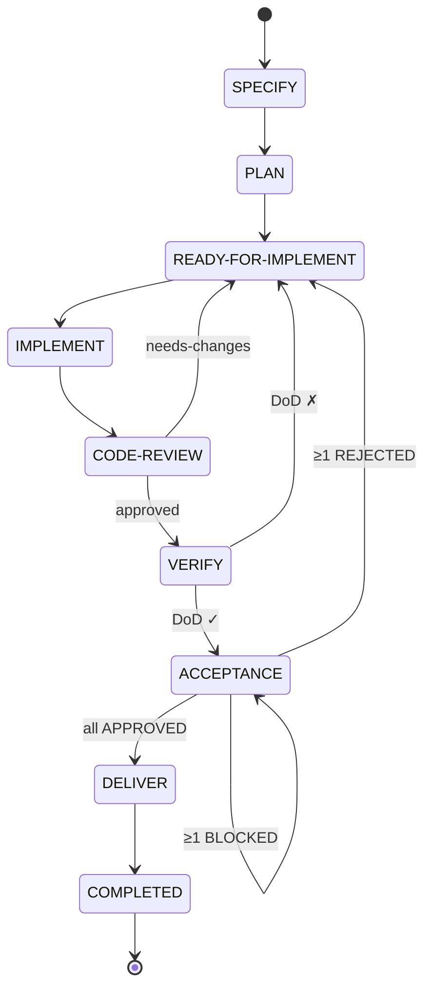

# Documentación del Dominio: Ciclo de Vida de Story (Story Lifecycle)

> **Bounded Context:** Story Lifecycle  
> **Nivel:** L1 — Historia de usuario atómica  
> **Dominio transversal:** [[domain-state-management]]  
> **Fuente canónica de transiciones:** [[state-machine]]  
> **Workflow narrativo:** [[specs-and-workflows]]

---

## 1. Visión General

* **Nombre del dominio:** Ciclo de Vida de Story
* **Objetivo del sistema:** Gobernar el ciclo de vida completo de una historia de usuario, desde su especificación funcional hasta su cierre administrativo, garantizando trazabilidad, calidad y valor entregado mediante transiciones gobernadas por roles, gates de calidad y políticas del proyecto.
* **Principales actores:**
  * **PO / PM** — Define la especificación y acepta el valor de negocio.
  * **Equipo de desarrollo** — Planifica, implementa y verifica la historia.
  * **Revisor** — Ejecuta la revisión de código independiente (humano o IA).
  * **CI/CD** — Ejecuta pruebas automáticas y despliega a producción.
  * **Sistema** — Coordina el pipeline y aplica reglas de WIP.
* **Bounded Contexts relacionados:**
  * **State Management** — Modelo transversal de estados, subestados y transiciones.
  * **Epic Lifecycle** — Contenedor de la historia (una historia pertenece a una épica).
  * **Project Lifecycle** — Nivel superior del proyecto.
* **Alcance de este documento:** estados específicos, subestados, pipeline, máquina de estados, invariantes, gates y trazabilidad **exclusivos del nivel Story**.

---

## 2. Lenguaje Ubicuo (Glosario)

* **Story:** Historia de usuario atómica que aporta valor de negocio. Identificada por `STORY-NNN`.
* **Pipeline Story:** Secuencia canónica de estados que recorre una historia: `SPECIFY → PLAN → READY-FOR-IMPLEMENT → IMPLEMENT → CODE-REVIEW → VERIFY → ACCEPTANCE → DELIVER → COMPLETED`.
* **Buffer (READY-FOR-IMPLEMENT):** Estado de cola que desacopla planificación de implementación, con WIP limitado.
* **Rework:** Retorno a `READY-FOR-IMPLEMENT` tras un rechazo en `CODE-REVIEW`, `VERIFY` o `ACCEPTANCE`. La señal de que una historia está en rework es la presencia del artefacto de fallo en su directorio (`fix-directives.md` para `CODE-REVIEW`); no existe estado ni substatus de rework (ver ADR-0008).
* **DoD (Definition of Done):** Conjunto de criterios que una historia debe cumplir para avanzar de estado.
* **Delivery Model:** Estrategia de entrega del proyecto (`batch` o `continuous`), que determina el significado de `DELIVER`.
* **Incremento potencialmente entregable:** Resultado de una historia que está lista para producción pero aún no publicada (aplica en modelo `batch`).

---

## 3. Modelo Táctico

### Entidades vs. Objetos de Valor

| Elemento | Tipo (Entidad/VO) | ¿Por qué? (Identidad/Inmutabilidad) |
| :--- | :--- | :--- |
| `Story` | Entidad | Tiene identidad única (`STORY-001`) que la rastrea a lo largo de su ciclo de vida. Su estado cambia con el tiempo. |
| `StoryArtifact` | Entidad | Documentos asociados (`story.md`, `design.md`, `tasks.md`, `testcases.md`) con identidad por ruta. |
| `ReviewReport` | Entidad | Reporte de revisión de código (`review.md`) con identidad por ronda de revisión. |
| `VerifyReport` | Entidad | Reporte de verificación (`verify-report.md`) con identidad por ejecución. |
| `StoryStatus` | Objeto de Valor | Inmutable. Conjunto cerrado de 9 estados específicos del nivel Story. |
| `StorySubstatus` | Objeto de Valor | Inmutable. Heredado del dominio transversal: `TODO`, `IN-PROGRESS`, `DONE`, `BLOCKED`. |
| `DeliveryModel` | Objeto de Valor | Inmutable. Valores: `batch`, `continuous`. Determina el significado de `DELIVER`. |
| `ReworkEvent` | Objeto de Valor | Inmutable. Se define por origen (revisión/verificación/aceptación), motivo y ronda. |
| `StoryParent` | Objeto de Valor | Inmutable. Referencia a la `Epic` contenedora (`EPIC-NNN`). |

### Agregado y Aggregate Root (AR)

* **Agregado Principal:** `Story` (AR)
* **Contenido interno:**
  * `StoryStatus` (VO)
  * `StorySubstatus` (VO)
  * `StoryArtifact` (Entidad) — `story.md` como artefacto principal
  * `StoryArtifact` (Entidad) — artefactos secundarios (`design.md`, `tasks.md`, `testcases.md`)
  * `ReviewReport` (Entidad) — reportes de revisión
  * `VerifyReport` (Entidad) — reportes de verificación
  * `ReworkEvent` (VO) — historial de reworks
  * `DeliveryModel` (VO) — determina el significado de `DELIVER`
  * `StoryParent` (VO) — referencia a la épica contenedora
  * `WipLimit` (VO) — aplicable solo en `READY-FOR-IMPLEMENT`

---

## 4. Pipeline de Estados

### 4.1 Happy path

```
SPECIFY → PLAN → READY-FOR-IMPLEMENT → IMPLEMENT → CODE-REVIEW → VERIFY → ACCEPTANCE → DELIVER → COMPLETED
```

### 4.2 Máquina de estados completa (con retrocesos)



### 4.3 Rutas alternativas

| Ruta | Descripción |
|------|-------------|
| **Happy path** | `SPECIFY → PLAN → RFI → IMPLEMENT → CODE-REVIEW → VERIFY → ACCEPTANCE → DELIVER → COMPLETED` |
| **Rework por revisión** | `CODE-REVIEW → READY-FOR-IMPLEMENT` (needs-changes) |
| **Rework por verificación** | `VERIFY → READY-FOR-IMPLEMENT` (DoD ✗) |
| **Rework por aceptación** | `ACCEPTANCE → READY-FOR-IMPLEMENT` (≥1 REJECTED) |
| **Bloqueo en aceptación** | `ACCEPTANCE → ACCEPTANCE` (≥1 BLOCKED, sin REJECTED) |
| **Cancelación** | `* → CANCELED` (desde cualquier estado activo) |

---

## 5. Tabla de Estados

| Status | Descripción | Actor | Substatus inicial |
|--------|-------------|-------|-------------------|
| `SPECIFY` | Se define el comportamiento de la historia: formato Como/Quiero/Para, criterios de aceptación con escenarios Gherkin. Fase funcional sin decisiones técnicas. | PO / PM | `IN-PROGRESS` |
| `PLAN` | Se diseña la solución técnica: `design.md`, `tasks.md`, `testcases.md`. Se estima esfuerzo y se define el enfoque (TDD/BDD). | Equipo | `IN-PROGRESS` |
| `READY-FOR-IMPLEMENT` | Buffer/cola. Historia planificada y aprobada, esperando capacidad del equipo. Aplica límite WIP. | Sistema | `DONE` |
| `IMPLEMENT` | Se codifica la historia siguiendo TDD/BDD (Rojo-Verde-Refactor). Se escriben pruebas y código de producción. | Equipo / IA | `IN-PROGRESS` |
| `CODE-REVIEW` | Se revisa el código implementado para garantizar calidad, estándares y coherencia con el diseño. | Revisor | `IN-PROGRESS` |
| `VERIFY` | Se ejecutan pruebas automatizadas (unitarias, integración, E2E, regresión) en entorno controlado. | CI / Equipo | `IN-PROGRESS` |
| `ACCEPTANCE` | Validación humana de la historia contra los criterios de aceptación de `SPECIFY`. El humano decide si el valor es entregable. | PO / QA | `IN-PROGRESS` |
| `DELIVER` | Incremento listo para producción (batch) o ya desplegado (continuous). Transición manual — no escribe ningún skill. | Humano / CI-CD | `IN-PROGRESS` |
| `COMPLETED` | Estado terminal pasivo. Sin acciones pendientes. Permite medir tiempos de ciclo sin reabrir artefactos. | — | `DONE` |
| `CANCELED` | La historia fue cancelada sin entregar. Estado terminal. | PO / PM | `DONE` |

---

## 6. Subestados Aplicables

| Substatus | Aplica en | Significado específico en Story |
|-----------|-----------|--------------------------------|
| `TODO` | `READY-FOR-IMPLEMENT` | Historia en cola, esperando capacidad del equipo. |
| `IN-PROGRESS` | `SPECIFY`, `PLAN`, `IMPLEMENT`, `CODE-REVIEW`, `VERIFY`, `ACCEPTANCE`, `DELIVER` | El rol correspondiente está trabajando activamente. |
| `DONE` | Todos los estados activos | El trabajo del estado ha terminado y la historia está lista para avanzar. |
| `BLOCKED` | `ACCEPTANCE` principalmente; puede aplicar a cualquier estado activo | Impedimento externo (ej. dependencia, decisión pendiente). No retrocede el status. |

---

## 7. Invariantes Específicas de Story

Además de las invariantes transversales de [[domain-state-management]]:

1. Una `Story` **siempre pertenece a una `Epic`** (`parent: EPIC-NNN` en el frontmatter).
2. Una `Story` solo puede estar en **un estado del pipeline Story** a la vez.
3. El estado `DELIVER` tiene **dos significados** según el `DeliveryModel`:
   * `batch`: incremento listo para producción, aún no publicado.
   * `continuous`: incremento ya desplegado en producción.
4. El estado `COMPLETED` no puede retroceder sin acción explícita de reapertura.
5. La transición `ACCEPTANCE → ACCEPTANCE` (con `BLOCKED`) mantiene el estado, pero documenta el impedimento.
6. Todos los retrocesos apuntan a `READY-FOR-IMPLEMENT/DONE`, no a `IMPLEMENT`.
7. El `READY-FOR-IMPLEMENT` debe respetar un **WIP limit** definido en la política del proyecto.
8. El estado terminal `COMPLETED` no admite transiciones salientes excepto `CANCELED` o reapertura explícita.

---

## 8. Gates de Calidad Específicos

| Gate | Estado | Qué valida |
|------|--------|------------|
| **CI en el PR** | `CODE-REVIEW` | Compilación, tests unitarios, linters. |
| **Revisión por pares** | `CODE-REVIEW` | Diseño, seguridad, estándares, coherencia con `design.md`. |
| **CI post-merge** | `VERIFY` | Integración, E2E, regresión. |
| **DoD de Story** | `VERIFY` | Criterios de la Definition of Done de Story (cobertura, pruebas, documentación). |
| **Aceptación del PO** | `ACCEPTANCE` | Criterios de aceptación de `story.md`, valor de negocio. |
| **WIP Limit** | `READY-FOR-IMPLEMENT` | No exceder el número máximo de historias en cola. |

---

## 9. Trazabilidad y Persistencia

* **Frontmatter de `story.md`** con `status`, `substatus`, `parent`, `deliveryModel`.
* **`TransitionHistory`** inmutable con cada cambio de estado (fecha, origen, destino, actor, motivo).
* **`ReworkEvent`** registrado cada vez que la historia retrocede, con ronda y motivo.
* **Reportes asociados:**
  * `review.md` — generado en cada ronda de `CODE-REVIEW`.
  * `verify-report.md` — generado en `VERIFY`.
  * `acceptance-report.md` (opcional) — generado en `ACCEPTANCE`.
* **Reapertura:** solo desde `COMPLETED` con acción explícita y registro del motivo.
* **Convención de guion:** ASCII U+002D `-`.

---

## 10. Fuentes de Verdad

* **Esquema canónico de frontmatter:** `header-aggregation/SKILL.md`
* **Máquina de estados completa:** [[state-machine]]
* **Workflow narrativo:** [[specs-and-workflows]]
* **Dominio transversal:** [[domain-state-management]]
* **Principios aplicables:** [[constitution]] (patrones 8, 14; reglas 9 y 15)
* **Decisión de arquitectura:** [[workflow-canonico-story-y-epic]] — rationale de los workflows canónicos de story y epic

---

## 11. Referencias Cruzadas

* [[domain-state-management]] — Modelo transversal de estados y transiciones
* [[domain-epic-lifecycle]] — Ciclo de vida de Epic (contenedor de Story)
* [[domain-project-lifecycle]] — Ciclo de vida de Project
* [[constitution]] — Constitución del proyecto
* [[workflow-canonico-story-y-epic]] — Workflow canónico de story y epic

