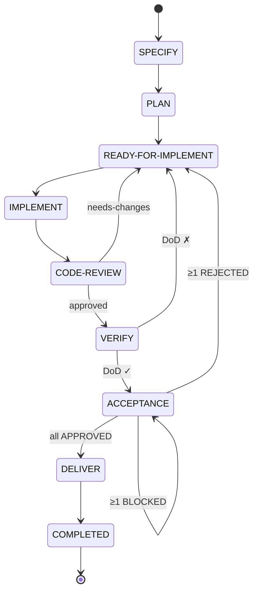
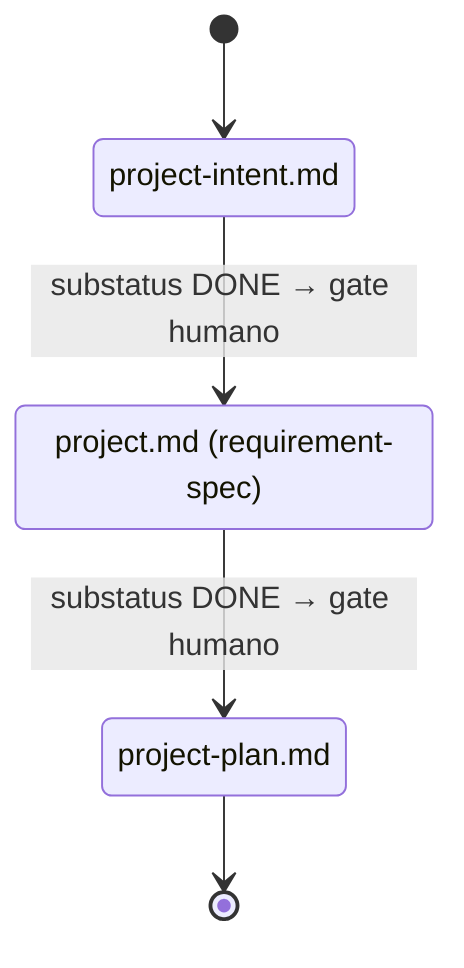
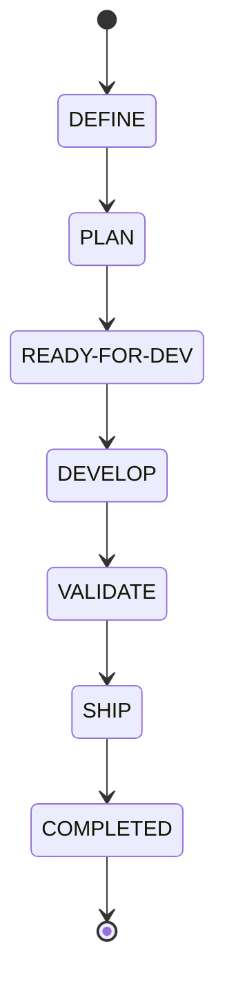

# Máquina de estados del framework SDDF

> Documento canónico de estados, subestados y transiciones del pipeline SDDF. Es la fuente de verdad para los skills que actualizan `story.md`, `release.md` y los documentos de proyecto.

## Modelo general

El ciclo de vida de un artefacto usa **dos ejes ortogonales**:

- `status` — etapa del pipeline (dónde está el work item)
- `substatus` — progreso dentro de la etapa (nivel de avance)

Principio de la constitución (patrón 14): **el ciclo de vida se traza con `status`+`substatus`, no con versiones numéricas**.

### Substatus canónicos

| Substatus | Significado |
|-----------|-------------|
| `TODO` | Pendiente de iniciar en el status actual |
| `IN-PROGRESS` | En ejecución activa |
| `DONE` | Completado; listo para avanzar al siguiente status |
| `BLOCKED` | Impedimento externo; no puede avanzar hasta resolverse |

`BLOCKED` no retrocede el status — el work item permanece en el status actual mientras espera. Ver [specs_and_workflows.md](specs_and_workflows.md) para la definición narrativa de cada substatus.

> **Convención de guion:** usar ASCII U+002D `-`. La normalización completa de guiones no-ASCII (U+2011) distribuidos en ~30 SKILL.md es ítem pendiente del backlog (EPIC-17).

---

## Nivel STORY

### Pipeline de estados



Happy path:
```
SPECIFY → PLAN → READY-FOR-IMPLEMENT → IMPLEMENT → CODE-REVIEW → VERIFY → ACCEPTANCE → DELIVER → COMPLETED
```

> Los nombres de estado usan verbos en infinitivo (SPECIFY, IMPLEMENT, VERIFY…) porque cada estado representa una acción que el equipo debe realizar, no un concepto estático. Ver [[workflow-canonico-story-y-epic]] (ADR-0003) para el rationale completo.

### Tabla de estados

| Status | Descripción | Actor |
|--------|-------------|-------|
| `SPECIFY` | Se define el comportamiento de la historia: formato Como/Quiero/Para, criterios de aceptación con escenarios Gherkin. Fase funcional sin decisiones técnicas. | PO / PM |
| `PLAN` | Se diseña la solución técnica: `design.md`, `tasks.md`, `testcases.md`. Se estima esfuerzo y se define el enfoque (TDD/BDD). | Equipo |
| `READY-FOR-IMPLEMENT` | Buffer/cola. Historia planificada y aprobada, esperando capacidad del equipo. Aplica límite WIP. | Sistema |
| `IMPLEMENT` | Se codifica la historia siguiendo TDD/BDD (Rojo-Verde-Refactor). Se escriben pruebas y código de producción. | Equipo / IA |
| `CODE-REVIEW` | Se revisa el código implementado por IA, humano y/u otros miembros del equipo para garantizar calidad y estándares. | Revisor |
| `VERIFY` | Se ejecutan pruebas automatizadas (unitarias, integración, E2E, regresión) en entorno controlado. | IA / CI |
| `ACCEPTANCE` | Validación humana de la historia contra los criterios de aceptación de SPECIFY. El humano decide si el valor es entregable. | PO / QA |
| `DELIVER` | Incremento listo para producción (batch) o ya desplegado (continuous). Transición manual — no la escribe ningún skill. | Humano / CI-CD |
| `COMPLETED` | Estado terminal pasivo. Sin acciones pendientes. Permite medir tiempos de ciclo sin reabrir artefactos. | — |

### Tabla de transiciones por skill

| Skill | Precondición de entrada | Estado al iniciar | Salida éxito | Retroceso |
|-------|------------------------|-------------------|--------------|-----------|
| `story-specify` | Sin precondición de estado | `SPECIFY/IN-PROGRESS` | `SPECIFY/DONE` | — |
| `story-plan` | `SPECIFY/DONE` | `PLAN/IN-PROGRESS` | delegado a `story-analyze` | — |
| `story-analyze` | Invocado por `story-plan` | — | `READY-FOR-IMPLEMENT/DONE` (sin ERRORs) | — |
| `story-implement` | `READY-FOR-IMPLEMENT/DONE` o `IMPLEMENT/IN-PROGRESS` (reanudación) | `IMPLEMENT/IN-PROGRESS` | `IMPLEMENT/DONE` | — |
| `story-code-review` | `IMPLEMENT/DONE` | `CODE-REVIEW/IN-PROGRESS` | `CODE-REVIEW/DONE` | `READY-FOR-IMPLEMENT/DONE` (needs-changes) |
| `story-verify` | `CODE-REVIEW/DONE` | `VERIFY/IN-PROGRESS` | `VERIFY/DONE` | `READY-FOR-IMPLEMENT/DONE` (DoD ✗) |
| `story-acceptance` | `VERIFY/DONE` | `ACCEPTANCE/IN-PROGRESS` | `ACCEPTANCE/DONE` | `READY-FOR-IMPLEMENT/DONE` (≥1 REJECTED) o `ACCEPTANCE/BLOCKED` (≥1 BLOCKED sin REJECTED) |

**DELIVER y COMPLETED son transiciones manuales** — ningún skill los escribe. DELIVER significa que el incremento está listo para producción (potencialmente entregable) o ya desplegado (entregado), según el modelo de entrega del equipo (batch vs. continuous). Lo marca el humano o CI/CD.

Los sub-skills `story-design`, `story-tasking` y `story-testcases` son invocados por `story-plan` y **no modifican `story.md`**: solo producen sus artefactos (`design.md`, `tasks.md`, `testcases.md`).

---

## Nivel PROJECT

Opera únicamente con **substatus** (el campo `status` no se usa a nivel de proyecto). Consta de 3 documentos secuenciales con gate humano entre fases.



Cada documento transita `substatus: IN-PROGRESS → DONE` dentro de su fase. Regla de la constitución (regla 9): **WIP = 1** — solo un documento puede tener `substatus: IN-PROGRESS` a la vez. El skill `project-flow` coordina las transiciones.

---

## Nivel RELEASE (Épica)

El release/épica usa `status` + `substatus` en `release.md` siguiendo el mismo modelo ortogonal que el nivel story.

### Pipeline de estados



Happy path:
```
DEFINE → PLAN → READY-FOR-DEV → DEVELOP → VALIDATE → SHIP → COMPLETED
```

### Tabla de estados

| Status | Descripción | Actor |
|--------|-------------|-------|
| `DEFINE` | Se define el alcance: objetivos, features, criterios de éxito y valor esperado. Se documenta en `release.md`. | PM / PO |
| `PLAN` | Se desglosan las historias, se asignan a releases, se estima esfuerzo y se identifican dependencias. | PM / Equipo |
| `READY-FOR-DEV` | Buffer/cola. Épica completamente planificada y aprobada. Espera capacidad del equipo. Aplica límite WIP. | Sistema |
| `DEVELOP` | Desarrollo en curso: las historias de la épica se implementan siguiendo su propio workflow. La épica permanece aquí hasta que todas las historias estén en `DELIVER`. | Equipo |
| `VALIDATE` | Pruebas de integración y regresión del conjunto completo: end-to-end, UAT, requisitos no funcionales. | QA / Equipo |
| `SHIP` | La épica se publica/despliega a producción. Último estado activo. | DevOps / CI-CD |
| `COMPLETED` | Estado terminal pasivo. Épica cerrada administrativamente. Sin acciones pendientes ni responsabilidades activas. Permite medir tiempos de ciclo sin reabrir artefactos. | — |

**SHIP y COMPLETED son transiciones manuales** (o disparadas por CI/CD) — ningún skill los escribe automáticamente.

Gate de calidad: `release-format-validation` valida la estructura del `release.md` como precondición para `release-generate-stories` (constitución, regla 15).


---

## Fuentes de verdad

- Esquema canónico de frontmatter: [header-aggregation/SKILL.md](../../../.claude/skills/header-aggregation/SKILL.md)
- Transiciones por skill: sección "Posicionamiento" de cada `story-*/SKILL.md`
- Workflow narrativo: [specs_and_workflows.md](specs_and_workflows.md) (descripción de estados y subestados)
- Principios aplicables: [constitution.md](../../policies/constitution.md) patrones 8, 14 y regla 9
- Decisión de arquitectura: [ADR-0003](../../adr/ADR-0003-workflow-canonico-story-y-epic.md) — rationale de los workflows canónicos de story y epic
