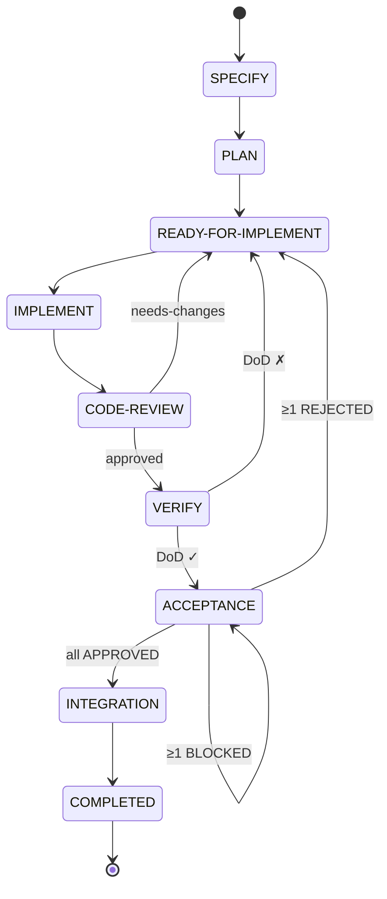
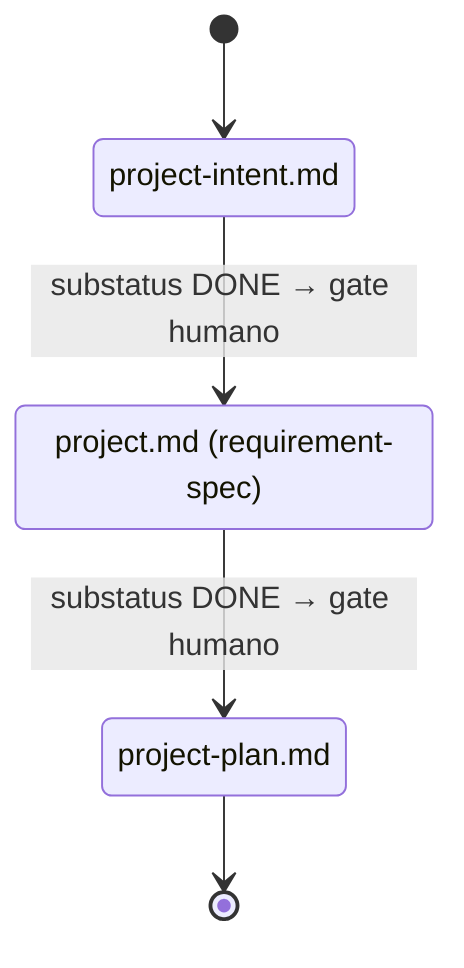
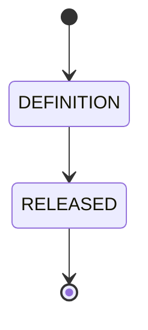

# Máquina de estados del framework SDDF

> Documento canónico de estados, subestados y transiciones del pipeline SDDF. Es la fuente de verdad para los skills que actualizan `story.md`, `release.md` y los documentos de proyecto.

## Modelo general

El ciclo de vida de un artefacto usa **dos ejes ortogonales**:

- `status` — etapa del pipeline (dónde está el work item)
- `substatus` — progreso dentro de la etapa (nivel de avance)

Principio de la constitución (patrón 14): **el ciclo de vida se traza con `status`+`substatus`, no con versiones numéricas**.

### Substatus canónicos

| Substatus | Significado |
|-----------|-------------|
| `TODO` | Pendiente de iniciar en el status actual |
| `IN-PROGRESS` | En ejecución activa |
| `DONE` | Completado; listo para avanzar al siguiente status |
| `BLOCKED` | Impedimento externo; no puede avanzar hasta resolverse |

`BLOCKED` no retrocede el status — el work item permanece en el status actual mientras espera. Ver [specs_and_workflows.md](specs_and_workflows.md) para la definición narrativa de cada substatus.

> **Convención de guion:** usar ASCII U+002D `-`. La normalización completa de guiones no-ASCII (U+2011) distribuidos en ~30 SKILL.md es ítem pendiente del backlog (EPIC-17).

---

## Nivel STORY

### Pipeline de estados



Happy path:
```
SPECIFY → PLAN → READY-FOR-IMPLEMENT → IMPLEMENT → CODE-REVIEW → VERIFY → ACCEPTANCE → INTEGRATION → COMPLETED
```

### Tabla de transiciones por skill

| Skill | Precondición de entrada | Estado al iniciar | Salida éxito | Retroceso |
|-------|------------------------|-------------------|--------------|-----------|
| `story-specify` | Sin precondición de estado | `SPECIFY/IN-PROGRESS` | `SPECIFY/DONE` | — |
| `story-plan` | `SPECIFY/DONE` | `PLAN/IN-PROGRESS` | delegado a `story-analyze` | — |
| `story-analyze` | Invocado por `story-plan` | — | `READY-FOR-IMPLEMENT/DONE` (sin ERRORs) | — |
| `story-implement` | `READY-FOR-IMPLEMENT/DONE` o `IMPLEMENT/IN-PROGRESS` (reanudación) | `IMPLEMENT/IN-PROGRESS` | `IMPLEMENT/DONE` | — |
| `story-code-review` | `IMPLEMENT/DONE` | `CODE-REVIEW/IN-PROGRESS` | `CODE-REVIEW/DONE` | `READY-FOR-IMPLEMENT/DONE` (needs-changes) |
| `story-verify` | `CODE-REVIEW/DONE` | `VERIFY/IN-PROGRESS` | `VERIFY/DONE` | `READY-FOR-IMPLEMENT/DONE` (DoD ✗) |
| `story-acceptance` | `VERIFY/DONE` | `ACCEPTANCE/IN-PROGRESS` | `ACCEPTANCE/DONE` | `READY-FOR-IMPLEMENT/DONE` (≥1 REJECTED) o `ACCEPTANCE/BLOCKED` (≥1 BLOCKED sin REJECTED) |

**INTEGRATION y COMPLETED son transiciones manuales** — ningún skill los escribe. Los marca el humano o CI/CD al integrar el código y cerrar la historia.

Los sub-skills `story-design`, `story-tasking` y `story-testcases` son invocados por `story-plan` y **no modifican `story.md`**: solo producen sus artefactos (`design.md`, `tasks.md`, `testcases.md`).

---

## Nivel PROJECT

Opera únicamente con **substatus** (el campo `status` no se usa a nivel de proyecto). Consta de 3 documentos secuenciales con gate humano entre fases.



Cada documento transita `substatus: IN-PROGRESS → DONE` dentro de su fase. Regla de la constitución (regla 9): **WIP = 1** — solo un documento puede tener `substatus: IN-PROGRESS` a la vez. El skill `project-flow` coordina las transiciones.

---

## Nivel RELEASE

El release usa **substatus** en `release.md` más un `status` de convención de frontmatter.



| Status observado | Significado |
|-----------------|-------------|
| `DEFINITION` | Release en definición (backlog activo, historias generándose) |
| `RELEASED` | Release desplegado; historias completadas |

Gate de calidad: `release-format-validation` valida la estructura del `release.md` como precondición para `release-generate-stories` (constitución, regla 15).

---

## Inconsistencias conocidas

| Inconsistencia | Estado |
|----------------|--------|
| `story-plan/SKILL.md` usaba `PLANNING` en lugar de `PLAN` en su tabla de ciclo de vida | Corregido en EPIC-17 (plan-09) |
| Normalización U+2011 → ASCII en `IN-PROGRESS` distribuida en ~30 SKILL.md | Pendiente — ítem abierto en EPIC-17 |
| `INTEGRATION` y `COMPLETED` sin skill asociado | Diseño aceptado: transiciones manuales/CI |
| Arquitecturas distintas por nivel (story: status+substatus; project/release: solo substatus) | Diseño aceptado — no es un bug |
| `header-aggregation/SKILL.md` lista `PLANNING` como valor de `status` en el esquema canónico | Pendiente de actualizar en EPIC-17 |

---

## Fuentes de verdad

- Esquema canónico de frontmatter: [header-aggregation/SKILL.md](../../../.claude/skills/header-aggregation/SKILL.md)
- Transiciones por skill: sección "Posicionamiento" de cada `story-*/SKILL.md`
- Workflow narrativo: [specs_and_workflows.md](specs_and_workflows.md) (descripción de estados y subestados)
- Principios aplicables: [constitution.md](../../policies/constitution.md) patrones 8, 14 y regla 9
