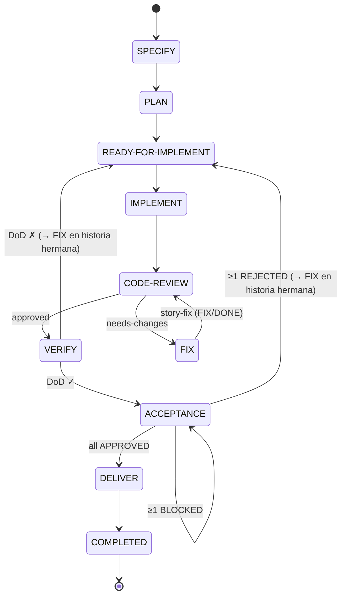

<!-- Referencias -->
[[STORY-089-story-fix-post-code-review]]

# Design: Ciclo de corrección con dueño tras un rechazo del pipeline

<!-- TRAZABILIDAD — este diseño cubre los criterios de aceptación de STORY-089:
     AC-1: El rechazo deja una entrega accionable e inequívoca (escenario principal)
     AC-2: Corrección aplicada en una historia planificada sin tasks.md (escenario alternativo)
     AC-3: Invocación fuera de precondiciones (escenario de error)
     AC-4: Estado FIX como punto único de reentrada (TODO → IN-PROGRESS → DONE; story-code-review acepta FIX/DONE)
     AC-5: Independencia del método de planificación (no exigir tasks.md)
     AC-6: Patrones estructurales de skills (skill-structural-pattern.md; fuente en skills/)
     AC-7: Lineamientos de skill-master y skill-creation-checklist (sin clave triggers)
     NF-1: Trazabilidad del estado FIX en state-machine.md, specs_and_workflows.md, enum de status y ADR
     NF-2: Degradación controlada (archivo inexistente → omitido, no aborta)
     NF-3: Idempotencia (re-ejecución sobre FIX/DONE no reaplica ni degrada) -->

## Context

El ciclo de corrección posterior a un rechazo de `/story-code-review` está roto en tres puntos verificados en el código actual (ver `story.md` → Notas / contexto):

1. **Contrato de recolección incompatible.** `story-code-review` (Paso 4g.1) agrega la línea `- [ ] Implementar fix-directives.md` a `tasks.md`, pero el parser de `story-implement-tasks` (Paso 2c) solo reconoce tareas con patrón `- [ ] T\d+` o `- [ ] \d+\.\d+`. La tarea inyectada nunca se recolecta.
2. **Estado de retroceso incompatible.** El rechazo deja `story.md` en `READY-FOR-IMPLEMENT/DONE` (Paso 4g.2), pero `story-code-review` exige `IMPLEMENT/DONE` como precondición para reejecutarse. El desarrollador queda obligado a editar el frontmatter a mano.
3. **Sin rastro sin `tasks.md`.** Cuando la historia se planificó con `/story-plan --only-testcases` no existe `tasks.md`, por lo que el rechazo no deja ningún artefacto accionable: el sub-flujo de corrección de `story-implement-tasks` es inalcanzable.

**Estado actual relevante (fuentes inspeccionadas):**
- `skills/story-code-review/SKILL.md` — Pasos 4f (genera `fix-directives.md`), 4g.1 (tarea en `tasks.md`), 4g.2 (retroceso a `READY-FOR-IMPLEMENT/DONE`), Paso 7 (mensaje final que dice "Ejecuta /story-code-review {story_id} nuevamente"), validación de precondición (`IMPLEMENT/DONE`).
- `skills/story-code-review/assets/fix-directives-template.md` — sección "Ciclo de corrección" que instruye reejecutar `/story-code-review` y menciona el estado inexistente `READY-FOR-VERIFY`.
- `skills/story-implement-tasks/SKILL.md` — Paso 3 "Sub-flujo: Implementar fix-directives.md" (sub-pasos 1–3): la lógica canónica de aplicación de correcciones que se reutiliza como base del nuevo skill.
- `docs/domain/state-machine.md` — documento canónico de estados; hoy la fila de `story-code-review` retrocede a `READY-FOR-IMPLEMENT/DONE` y no existe el status `FIX` ni skill de salida asociado. `docs/domain/specs_and_workflows.md` ya dibuja el flujo deseado (rejected path convergiendo en un estado de corrección).
- `docs/guides/skill-structural-pattern.md` §8 y `skills/header-aggregation/SKILL.md` — enum canónico de `status` para frontmatter; no incluye `FIX`.
- `docs/adr/ADR-0006-migracion-retroactiva-de-estados-de-epica.md` (supersede a ADR-0003) — decisión vigente sobre los workflows canónicos; inmutable, se extiende con un ADR nuevo.
- `docs/policies/skill-creation-checklist.md` — reglas deterministas: `name` = directorio, `description` con gatillos, **sin clave `triggers:`**, `evals/evals.json` obligatorio, rutas relativas.
- `AGENTS.md` — `skills/` (raíz) es la fuente única de skills; `.claude/skills/` es salida de instalación.

**Convenciones detectadas (contexto técnico del proyecto):**
- El "código de producción" de este repositorio son **skills** (`sddf.config.yaml`: `layer: monolithic … todo el código de producción son skills`). No hay capas frontend/backend/database.
- Un skill vive en `skills/<skill-name>/` con `SKILL.md` (frontmatter `name`/`description` + instrucciones), `assets/`, `examples/`, `evals/`.
- **Regla de transición del pipeline:** cada skill cierra su propio status en `DONE`; el skill siguiente escribe `<status-siguiente>/IN-PROGRESS` al arrancar. Ningún skill escribe el `DONE` de un status ajeno.
- Los skills que transitan estado validan precondiciones antes de actuar (fail-fast, sin modificar archivos si la precondición falla). `story-implement` ya acepta dos precondiciones (`READY-FOR-IMPLEMENT/DONE` o `IMPLEMENT/IN-PROGRESS`): la precondición múltiple tiene precedente.
- Patrón de idempotencia declarado (patrón 11): si el artefacto ya existe u operación ya se aplicó, no reaplicar ni degradar.

**Decisión de alcance heredada de la historia:** crear un skill propio `/story-fix` (dueño único del ciclo de corrección) y un status propio de primer nivel `FIX`, sink común de los tres gates de rechazo. En esta historia se conecta un solo productor (`story-code-review`); `story-verify` y `story-acceptance` se conectan en una historia hermana. El sub-flujo antiguo dentro de `story-implement-tasks` **no se retira** (fuera de alcance).

## Goals / Non-Goals

**Goals:**
- **G1** — Que `/story-code-review`, ante `needs-changes`, deje una entrega accionable e inequívoca: `fix-directives.md` presente, `story.md` en `FIX/TODO`, y mensaje final que remita a `/story-fix <story_id>` sin mencionar reejecutar `/story-code-review` como acción inmediata. // satisface: AC-1
- **G2** — Un nuevo skill `/story-fix` que marca `FIX/IN-PROGRESS`, aplica las correcciones de `fix-directives.md` sobre los archivos indicados, genera `fix-report.md` con el resultado por hallazgo (aplicado / omitido + motivo) y cierra en `FIX/DONE`. // satisface: AC-2
- **G3** — `story-code-review` acepta `FIX/DONE` además de `IMPLEMENT/DONE` como precondición de entrada, cerrando el bucle sin edición manual de frontmatter. // satisface: AC-2, AC-4
- **G4** — `/story-fix` opera únicamente desde `fix-directives.md` + frontmatter de `story.md`, sin exigir `tasks.md`. // satisface: AC-5
- **G5** — `/story-fix` valida sus precondiciones y, si no se cumplen, se detiene sin modificar nada, nombra la precondición incumplida y el estado real, e indica el skill que corresponde. // satisface: AC-3
- **G6** — Reflejar el status `FIX` (ciclo `TODO → IN-PROGRESS → DONE`, entrada `story-code-review`, salida `story-fix`) en `docs/domain/state-machine.md`, `docs/domain/specs_and_workflows.md`, el enum canónico de status y un ADR que extiende ADR-0006. // satisface: AC-4, NF-1
- **G7** — El skill cumple los patrones estructurales (AC-6) y los lineamientos de `skill-master` + `skill-creation-checklist` (AC-7): fuente en `skills/story-fix/`, frontmatter sin `triggers`, preflight Paso 0, template como fuente de verdad, ejemplos y evals.

**Non-Goals:**
- Conectar `story-verify` y `story-acceptance` a `FIX` (retroceso + generación de `fix-directives.md` desde sus reportes): historia hermana. Aquí solo se define el estado como destino común y el campo `origin` del artefacto.
- Reanudación de `/story-fix` desde `FIX/IN-PROGRESS`: fuera de alcance; el skill acepta solo `FIX/TODO`.
- Aceptar `FIX/TODO` como precondición de `story-implement` (rework completo con TDD).
- Retirar el sub-flujo de corrección alojado en `story-implement-tasks`.
- Corregir el estado inexistente `READY-FOR-VERIFY` fuera de la mención concreta del `fix-directives-template.md` que este cambio toca.
- Implementar/hacer cumplir la lista blanca de archivos permitidos como mecanismo vinculante.
- Generar código de dominio: `/story-fix` aplica las correcciones textuales indicadas en `fix-directives.md`, no reimplementa la historia con TDD.

## Decisions

### D-1 — `/story-fix` como skill propio con dueño único del ciclo de corrección
El ciclo de corrección post-rechazo tiene un solo dueño: el skill `story-fix`. Lee `fix-directives.md`, aplica correcciones y cierra en `FIX/DONE`. // satisface: AC-2, AC-5

- **Alternativa rechazada A — reparar el parser de `story-implement-tasks`:** obligaría a que `tasks.md` sea artefacto obligatorio, rompiendo la promesa de `/story-plan --only-testcases`.
- **Alternativa rechazada B — extender `story-implement`:** contradice el contrato que ese skill declara sobre sí mismo (ciclo TDD RED→GREEN→REFACTOR).

### D-2 — Status de primer nivel `FIX` como sink único de rechazo
El rechazo deja `story.md` en `status: FIX` / `substatus: TODO`. `FIX` es el destino común de los tres gates de rechazo del pipeline (`CODE-REVIEW` needs-changes, `VERIFY` DoD ✗, `ACCEPTANCE` ≥1 REJECTED); en esta historia se conecta `CODE-REVIEW`. Su ciclo interno usa los substatus canónicos: `TODO` (rechazada, pendiente), `IN-PROGRESS` (`story-fix` trabajando), `DONE` (corregida, lista para revisión). // satisface: AC-1, AC-4, NF-1

- **Alternativa rechazada — `READY-FOR-IMPLEMENT` + etiqueta de rechazo:** sobrecarga la semántica del buffer (planificada, esperando capacidad; aplica WIP), obliga a que cada lector de ese estado (`story-implement`, `story-implement-tasks`) bifurque por la etiqueta, pierde la métrica de retrabajo, y la etiqueta sería de todos modos un substatus nuevo (enum cerrado) o un campo nuevo (tres escritores, contra el principio de STORY-090). La detección queda dispersa en lectores en vez de concentrada en un consumidor.
- **Alternativa rechazada — substatus `NEEDS-CHANGES` dentro de `CODE-REVIEW`:** no generaliza a `VERIFY`/`ACCEPTANCE` y parte en tres estados de rechazo lo que el flujo deseado modela como uno.
- **Alternativa rechazada — dos status (`IMPLEMENT-REJECTED` + `FIXING`):** "rechazada esperando corrección" y "corrigiéndose" son un solo status con dos substatus; es el patrón de todos los estados del pipeline (`IMPLEMENT/TODO → IN-PROGRESS → DONE`).
- **Nombre:** `FIX` respeta la convención de ADR-0003/0006 (estado nombrado por la acción que toca hacer) frente a `IMPLEMENT-REJECTED` (describe lo ocurrido), y coincide con `story-fix` y `fix-directives.md`. `REWORK` sería el término Kanban; se prefiere `FIX` por coherencia con los artefactos existentes.

### D-3 — Salida de `/story-fix` a `FIX/DONE`; `story-code-review` acepta `FIX/DONE`
Tras aplicar las correcciones, `/story-fix` deja `story.md` en `status: FIX` / `substatus: DONE`. `story-code-review` amplía su precondición de entrada a `IMPLEMENT/DONE | FIX/DONE` y, como hoy, escribe `CODE-REVIEW/IN-PROGRESS` al arrancar. // satisface: AC-2, AC-4

- **Por qué `FIX/DONE` y no `IMPLEMENT/DONE`:** cada skill cierra su propio status; ningún skill escribe el `DONE` de un status ajeno. Salir a `IMPLEMENT/DONE` habría sido la única excepción del pipeline y además borraría la distinción entre "implementada por primera vez" y "corregida" (métrica de retrabajo).
- **Por qué no `FIX/DONE` sin tocar `story-code-review`:** el bucle no cerraría sin edición manual. Ampliar la precondición es una línea con precedente (`story-implement` acepta dos precondiciones).
- **Alternativa rechazada — dejar en `CODE-REVIEW/IN-PROGRESS`:** `story-fix` estaría escribiendo el status de otro skill y dejaría un estado ambiguo.

### D-4 — Reutilización de la lógica de aplicación de correcciones ya existente
El motor de aplicación de `/story-fix` reutiliza el algoritmo del "Sub-flujo: Implementar fix-directives.md" de `story-implement-tasks` (Paso 3, sub-pasos 1–3): leer la tabla "Instrucciones de corrección", iterar filas, extraer `Archivo:Línea`, verificar existencia, aplicar `Acción requerida`, y no abortar ante archivo inexistente. // satisface: AC-2, NF-2, P3 (reutilización)

- `fix-directives.md` gana un campo de frontmatter `origin: code-review | verify | acceptance` (en esta historia siempre `code-review`), que `fix-report.md` copia. Así los tres productores comparten un único contrato de entrada y `story-fix` no necesita leer tres formatos de reporte.
- **Alternativa rechazada — diseñar un formato nuevo de directivas:** `fix-directives.md` ya es el artefacto canónico; crear otro duplicaría fuente de verdad. Se reutiliza su tabla de columnas `#`, `Archivo:Línea`, `Dimensión`, `Severidad`, `Hallazgo`, `Acción requerida`.

### D-5 — Idempotencia por precondición de estado
La idempotencia (NF-3) se obtiene de D-2 + D-3: tras un `/story-fix` exitoso la historia está en `FIX/DONE`, que **no** es la precondición de `/story-fix` (`FIX/TODO`). Reejecutar el skill sobre una historia ya corregida cae en la validación de precondición (G5) y se detiene sin reaplicar cambios ni degradar el estado alcanzado. El mensaje de precondición, en ese caso, sugiere `/story-code-review`. // satisface: NF-3

- **Alternativa rechazada — marcar filas aplicadas dentro de `fix-directives.md`:** añade estado mutable al artefacto de directivas; la precondición de estado ya garantiza la no-reaplicación con menor superficie.
- **Reanudación desde `FIX/IN-PROGRESS`** (ejecución interrumpida) es el único caso donde la idempotencia no sale gratis de la precondición: exigiría leer un `fix-report.md` parcial. Fuera de alcance (Non-Goal); una interrupción se resuelve reponiendo `substatus: TODO`.

### D-6 — Ajustes en `story-code-review` (productor y consumidor del traspaso)
`story-code-review` se modifica en el punto de rechazo para producir el nuevo contrato, y en su precondición para consumirlo: // satisface: AC-1, AC-4, NF-1

- Paso 4g.2 → escribir `status: FIX` / `substatus: TODO` (antes `READY-FOR-IMPLEMENT/DONE`).
- Paso 4g.1 → deja de inyectar `- [ ] Implementar fix-directives.md` en `tasks.md` (mecanismo roto y ya innecesario; el rastro accionable pasa a ser `fix-directives.md` + el status `FIX`). El paso queda sin dependencia de `tasks.md`. // satisface: AC-5
- Paso 4f → `fix-directives.md` incluye `origin: code-review` en su frontmatter (D-4).
- Paso 7 (mensaje final needs-changes) → indicar "Ejecuta `/story-fix <story_id>`" como paso siguiente; **no** mencionar reejecutar `/story-code-review` como acción inmediata.
- Validación de precondición de entrada → aceptar `IMPLEMENT/DONE` **o** `FIX/DONE`.
- Tabla "Restricciones / Reglas" y sección "Posicionamiento" → reflejar `FIX/TODO` como salida de needs-changes y `FIX/DONE` como entrada alternativa.
- `assets/fix-directives-template.md` → campo `origin` en frontmatter; sección "Ciclo de corrección" apunta a `/story-fix`; se elimina la mención al estado inexistente `READY-FOR-VERIFY`.

### D-7 — Componentes afectados

| Componente | Acción | Ubicación | AC que satisface |
|---|---|---|---|
| `story-fix/SKILL.md` | crear | `skills/story-fix/SKILL.md` | AC-2, AC-3, AC-5, AC-6, AC-7 |
| `fix-report-template.md` | crear | `skills/story-fix/assets/fix-report-template.md` | AC-2, NF-2 |
| Ejemplos de `story-fix` | crear | `skills/story-fix/examples/` | AC-7 |
| Evals de `story-fix` | crear | `skills/story-fix/evals/evals.json` | AC-7 |
| `story-code-review/SKILL.md` | modificar (precondición; Pasos 4f, 4g.1, 4g.2, 7; Posicionamiento; Restricciones) | `skills/story-code-review/SKILL.md` | AC-1, AC-4 |
| `story-code-review/evals/evals.json` | modificar (caso needs-changes → `FIX/TODO`; caso de entrada `FIX/DONE`) | `skills/story-code-review/evals/evals.json` | AC-1, AC-4 |
| `fix-directives-template.md` | modificar (frontmatter `origin`; sección "Ciclo de corrección") | `skills/story-code-review/assets/fix-directives-template.md` | AC-1 |
| `state-machine.md` | modificar (mermaid, tabla de estados, tabla de transiciones) | `docs/domain/state-machine.md` | NF-1 |
| `specs_and_workflows.md` | modificar (definición del estado `FIX` en la lista de estados; diagrama rejected path) | `docs/domain/specs_and_workflows.md` | NF-1 |
| Enum canónico de `status` | modificar (añadir `FIX`) | `docs/guides/skill-structural-pattern.md` §8, `skills/header-aggregation/SKILL.md` | NF-1 |
| `ADR-0007` | crear (extiende ADR-0006: estado `FIX` como sink de rechazo, ciclo de substatus, precondición doble de code-review) | `docs/adr/ADR-0007-estado-fix-ciclo-de-correccion.md` | NF-1 |
| Instalación local | sincronizar `skills/` → `.claude/skills/` tras los cambios | `.claude/skills/` (salida de instalación, no versionada) | AC-6 |

> Nota: todos los componentes son artefactos de skills/documentación (el "código de producción" de este repo). No hay esquema de base de datos ni API. `package.json` ya publica `skills/` completo, por lo que no requiere cambios para el nuevo skill.

### D-8 — Contrato de interfaz del skill `/story-fix`

| Interfaz | Contrato | AC que satisface |
|---|---|---|
| Invocación | `/story-fix {story_id}` \| `/story-fix {story_path}` | AC-2 |
| Precondición de estado | `story.md.status == FIX` **Y** `story.md.substatus == TODO` | AC-3, D-2 |
| Precondición de artefacto | `fix-directives.md` existe en `$STORY_DIR` | AC-3 |
| Estado al iniciar | `story.md` → `FIX/IN-PROGRESS` (antes de tocar cualquier otro archivo) | AC-2, AC-4 |
| Entrada de datos | tabla "Instrucciones de corrección" de `fix-directives.md` (cols: `#`, `Archivo:Línea`, `Dimensión`, `Severidad`, `Hallazgo`, `Acción requerida`) + frontmatter `origin` | AC-2 |
| Salida — artefacto | `$STORY_DIR/fix-report.md` (resultado por hallazgo: aplicado / omitido + motivo; `origin` copiado) | AC-2, NF-2 |
| Salida — estado | `story.md` → `status: FIX` / `substatus: DONE` | AC-2, AC-4, D-3 |
| Salida — error precondición | mensaje que nombra la precondición incumplida + estado real + skill sugerido; **cero** archivos modificados. Skill sugerido: `FIX/DONE` → `/story-code-review`; `IMPLEMENT/DONE` → `/story-code-review`; `READY-FOR-IMPLEMENT/DONE` → `/story-implement`; `FIX/IN-PROGRESS` → reponer `TODO` (reanudación fuera de alcance); `FIX/TODO` sin `fix-directives.md` → `/story-code-review` (regenerar directivas) | AC-3 |
| Independencia | no lee ni exige `tasks.md` en ninguna rama | AC-5, G4 |

**Frontmatter del `SKILL.md` de `story-fix`** (patrón estructural 2 + `skill-creation-checklist`): `name: story-fix`, `description` (`>-` folded) que incluya las frases gatillo ("story-fix", "aplicar fix-directives", "corregir hallazgos de code review", "ciclo de corrección post-rechazo"). **Sin clave `triggers:`.** Preflight como Paso 0 (patrón 3). Template `assets/fix-report-template.md` como fuente de verdad del output (patrón 5). Rutas relativas al directorio del skill. // satisface: AC-6, AC-7

### D-9 — Flujo de `/story-fix` (escenario alternativo, sin `tasks.md`) — satisface: AC-2, AC-4, AC-5, NF-2

```
Paso 0  Preflight (skill-preflight) → si inválido, detener
Paso 1  Resolver story_id → $STORY_DIR (glob 03-stories/{id}-*)
Paso 2  Validar precondiciones (fail-fast, sin modificar nada):
          2a. story.md.status == FIX && substatus == TODO ?
          2b. fix-directives.md existe ?
          → si alguna falla: emitir error (precondición incumplida + estado real
            + skill sugerido según D-8) y DETENER                       [AC-3]
Paso 3  story.md → FIX/IN-PROGRESS                                    [AC-4]
Paso 4  Leer fix-directives.md → frontmatter origin + tabla "Instrucciones de corrección"
Paso 5  Por cada fila (NO requiere tasks.md):                         [AC-5]
          - extraer archivo:línea de "Archivo:Línea"
          - ¿archivo existe?
              no → registrar "omitido — archivo no encontrado", continuar   [NF-2]
              sí → aplicar "Acción requerida"; registrar "aplicado"
Paso 6  Generar fix-report.md desde assets/fix-report-template.md
        (una fila por hallazgo: aplicado/omitido+motivo; origin)
Paso 7  story.md → FIX/DONE                                            [D-3]
Paso 8  Resumen final: N aplicados / M omitidos; sugerir /story-code-review
        (acepta FIX/DONE — sin edición manual de frontmatter)
```

### D-10 — Flujo de traspaso desde `/story-code-review` (needs-changes) — satisface: AC-1

```
story-code-review (precondición: IMPLEMENT/DONE | FIX/DONE)  [D-6]
  → al iniciar: story.md → CODE-REVIEW/IN-PROGRESS       (sin cambios)
  → 4d  review-status = needs-changes
  → 4f  genera fix-directives.md con origin: code-review   [D-4, D-6]
  → 4g.1 [D-6] YA NO inyecta tarea en tasks.md
  → 4g.2 [D-6] story.md → FIX/TODO
  → 7    [D-6] mensaje final: "Ejecuta /story-fix <story_id>"
              (no menciona reejecutar /story-code-review como acción inmediata)
```

### D-11 — Máquina de estados resultante (nivel STORY)



Fila nueva y fila modificada en la tabla de transiciones por skill de `state-machine.md`:

| Skill | Precondición de entrada | Estado al iniciar | Salida éxito | Retroceso |
|---|---|---|---|---|
| `story-code-review` | `IMPLEMENT/DONE` o `FIX/DONE` | `CODE-REVIEW/IN-PROGRESS` | `CODE-REVIEW/DONE` | `FIX/TODO` (needs-changes) |
| `story-fix` | `FIX/TODO` | `FIX/IN-PROGRESS` | `FIX/DONE` | — (si aborta, permanece `FIX/IN-PROGRESS`; reponer `TODO`) |

Descripción del estado para la tabla de estados: `FIX` — "Se corrigen los hallazgos de un gate que rechazó la historia (`fix-directives.md`). Actor: Equipo / IA. Es el destino común de los rechazos del pipeline; la corrección vuelve a atravesar todos los gates."

### D-12 — Trazabilidad AC → elemento de diseño

| AC / NF | Enunciado (resumen) | Elemento(s) de diseño |
|---|---|---|
| AC-1 | Rechazo deja entrega accionable e inequívoca | D-6, D-10, D-7 (`story-code-review`, `fix-directives-template.md`) |
| AC-2 | Corrección aplicada sin `tasks.md` | D-1, D-3, D-4, D-8, D-9 |
| AC-3 | Invocación fuera de precondiciones | D-8 (precondiciones + tabla de skill sugerido), D-9 (Paso 2), G5 |
| AC-4 | `FIX` como punto único de reentrada; ciclo `TODO → IN-PROGRESS → DONE`; code-review acepta `FIX/DONE` | D-2, D-3, D-6, D-9 (Pasos 3 y 7), D-11 |
| AC-5 | Independencia del método de planificación | D-1, D-6 (4g.1), D-8 (Independencia), D-9 (Paso 5) |
| AC-6 | Patrones estructurales de skills; fuente en `skills/` | D-7 (estructura y ubicación), D-8 (frontmatter, preflight, template) |
| AC-7 | Lineamientos de skill-master y checklist | D-7 (assets/examples/evals), D-8 (sin `triggers`, `description` con gatillos) |
| NF-1 | Trazabilidad de `FIX` en docs canónicos, enum y ADR | D-2, D-6, D-7, D-11, G6 |
| NF-2 | Degradación controlada | D-4, D-9 (Paso 5: archivo inexistente → omitido) |
| NF-3 | Idempotencia | D-5 |

### D-13 — Decisiones de complejidad justificada
- **Un status con tres substatus en vez de dos status (D-2):** "rechazada" y "corrigiéndose" son fases de la misma etapa; el substatus ya modela eso en todo el pipeline. (KISS)
- **Sink único en vez de tres estados de rechazo (D-2):** un destino común evita tres skills de salida y tres precondiciones distintas en `story-fix`.
- **Idempotencia por precondición (D-5):** se evita introducir estado mutable en `fix-directives.md`. (YAGNI)
- **Reutilizar el algoritmo de corrección existente (D-4):** no se inventa un motor nuevo. (Reutilización antes de crear)
- **Precondición doble en `story-code-review` (D-3):** una línea con precedente, a cambio de no romper la regla "cada skill cierra su propio status".

## Risks / Trade-offs

- **[R1] Ambigüedad de "aplicar la Acción requerida"** → El texto de `Acción requerida` es lenguaje natural; su aplicación depende de interpretación del ejecutor. **Mitigación:** `/story-fix` aplica la corrección al `Archivo:Línea` indicado y **registra en `fix-report.md`** qué hizo por cada hallazgo; los casos no aplicables se marcan "omitido + motivo" en lugar de forzar un cambio incorrecto.
- **[R2] Sub-flujo antiguo en `story-implement-tasks` queda como código muerto alcanzable en teoría** → **Mitigación:** con D-6 (4g.1) `story-code-review` deja de inyectar la tarea; el sub-flujo se vuelve inalcanzable de facto. Retirarlo es historia hermana.
- **[R3] Ventana de inconsistencia entre gates** → Hasta que la historia hermana conecte `story-verify` y `story-acceptance`, esos dos gates siguen retrocediendo a `READY-FOR-IMPLEMENT/DONE`. **Mitigación:** `state-machine.md` documenta `FIX` como destino común y marca explícitamente las dos transiciones pendientes con referencia a la hermana; `story-fix` no depende de ellas.
- **[R4] `FIX/IN-PROGRESS` huérfano tras una interrupción** → `story-fix` no acepta ese estado. **Mitigación:** el mensaje de precondición indica reponer `substatus: TODO`; la reanudación real queda como Non-Goal documentado.
- **[R5] `fix-directives.md` sin filas bloqueantes o tabla vacía** → **Mitigación:** `/story-fix` trata la tabla vacía como "0 aplicados / 0 omitidos", genera `fix-report.md` informativo y aun así transiciona a `FIX/DONE` (el review posterior reevaluará). Ver OQ-2.
- **[R6] Enum de status duplicado en dos documentos** (`skill-structural-pattern.md` §8 y `header-aggregation`) → riesgo de olvidar uno. **Mitigación:** tarea explícita para ambos y caso de verificación documental en `testcases.md`.

## Open Questions

- **OQ-1** — ¿`fix-report.md` debe usar un template en `assets/` (patrón 5) o basta una estructura embebida? El diseño asume **template en `assets/fix-report-template.md`** por coherencia con `story-code-review` y `story-implement-tasks`.
- **OQ-2** — Ante `fix-directives.md` con tabla de instrucciones vacía, ¿transicionar igualmente a `FIX/DONE` (asunción actual, R5) o detener con aviso? Recomendación: transicionar con `fix-report.md` informativo.
- **OQ-3** — ¿`/story-fix` debe hacer cumplir la "Lista blanca de archivos permitidos" de `fix-directives.md`? Fuera de alcance explícito.

## Registro de Cambios (CR)

### CR-001
- **Tipo**: dependencia (ruta documental)
- **Descripción**: La historia referenciaba `docs/knowledge/guides/…`; los documentos canónicos viven ahora en `docs/domain/state-machine.md` y `docs/domain/specs_and_workflows.md`, y la guía de patrones en `docs/guides/skill-structural-pattern.md`.
- **Documento afectado**: story.md (Requerimiento "Patrones estructurales" y Criterio no funcional "Trazabilidad")
- **Acción requerida**: **Resuelto** — rutas corregidas en `story.md` y en este diseño.

### CR-002
- **Tipo**: cambio de diseño (modelo de estados)
- **Descripción**: Se reemplaza el substatus local `CODE-REVIEW/NEEDS-CHANGES` (D-2 original) por el status de primer nivel `FIX` con ciclo `TODO → IN-PROGRESS → DONE`, y la salida de `story-fix` pasa de `IMPLEMENT/DONE` a `FIX/DONE` con precondición doble en `story-code-review`. Motivo: alinear con el rejected path definido en `docs/domain/specs_and_workflows.md` (sink único para los tres gates) y con la regla "cada skill cierra su propio status".
- **Documento afectado**: story.md (título, escenarios, requerimiento nuevo, NF-1), design.md (D-2, D-3, D-6, D-7, D-8, D-9, D-11), testcases.md, tasks.md.
- **Acción requerida**: **Aplicado** en la re-planificación de 2026-09-10. `analyze.md` debe regenerarse (`/story-analyze STORY-089`) antes de implementar.

### CR-003
- **Tipo**: restricción de política
- **Descripción**: `docs/policies/skill-creation-checklist.md` rechaza la clave `triggers:` en el frontmatter de un skill; `AGENTS.md` fija `skills/` como fuente única (no `.claude/skills/`).
- **Documento afectado**: story.md (requerimientos de patrones y skill-master), design.md (D-7, D-8).
- **Acción requerida**: **Aplicado** — gatillos dentro de `description`; rutas de componentes en `skills/`.
